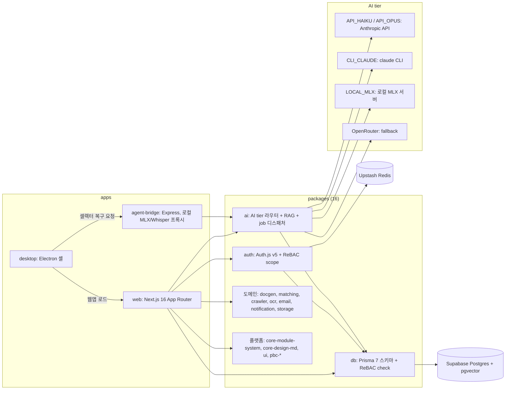

# AXLE

정부 지원사업·벤처/연구소 인증·특허·재무 컨설팅 업무를 한 시스템에서 처리하려고 만든 TypeScript monorepo 웹 플랫폼.

> [!IMPORTANT]
> **보존 상태 (2026-10): 운영 종료, 개발 사례로 보존.** 데이터베이스 일시정지 — 배포 주소는 동작하지 않음.
> 이 레포는 "어떻게 만들었는가"를 남기는 기록이다. E2E 워크플로 2개는 2026-10에 수동 실행 전용으로 바꿨다.

## 무엇을 풀려고 했나

[docs/L0-vision/README.md](docs/L0-vision/README.md) 기준.

- 사용자: 2~5인 컨설팅 팀(주 사용자), 고객사 담당자(서류 업로드·연구일지 작성)
- 풀려던 문제:

| 기존 방식 | AXLE에서 하려던 것 |
|---|---|
| 메신저·메일·폴더에 흩어진 고객사 정보 | 고객사별 단일 화면 |
| 지원사업 공고 수동 검색 | 공고 수집(크롤러) + 매칭 점수 |
| 사업계획서 수동 작성 | RAG 초안 생성 → 편집 → DOCX/HWPX |
| 메신저로 서류 요청 | 만료 토큰 링크로 고객사가 직접 업로드 |
| 미팅 메모 수기 | 녹음 → 전사 → 요약 → 액션 아이템 |
| 연구일지 엑셀 | AI 초안 + 웹 작성·승인 |

L0 문서에는 "사업계획서 작성 시간 50% 단축, 서류 수집 자동화율 80%" 같은 목표치가 있지만, 달성 여부를 잰 기록은 레포에 없다.

범위는 단계별로 이렇게 바뀌었다.

| 시기 | 단계 | 내용 | 근거 |
|---|---|---|---|
| 2026-04-10 | Phase 0~16 | 컨설팅 기능 17개 도메인(CRM, 서류, 프로젝트, AI 엔진, 문서 생성, 매칭, 미팅, 연구일지, 재무, 견적·계약, agent-bridge, desktop, cron 등) | [PRD.md](PRD.md), [docs/plans/](docs/plans/) |
| 2026-04-21 | Phase 17~18 | 엔진은 있는데 UI·배선이 끊긴 항목 연결(Gap Fix), 인증 업무 자동화 | [.flowset/fix_plan.md](.flowset/fix_plan.md) |
| 2026-05-04 | Phase 19 | 메타플랫폼: 6 Pack 모듈 카탈로그, multi-org tenancy, PBC 패키지 추출 | [docs/specs/meta-platform/PRD.md](docs/specs/meta-platform/PRD.md) |
| 2026-05-15~17 | Phase 20~21 | AI ERP: 영수증 OCR intake, 거래처·계정과목, 매출/손익/재고 리포트 | [docs/specs/](docs/specs/), [docs/plans/](docs/plans/) |

## 구조



- `apps/web` — 화면과 API를 모두 가진 단일 Next.js 앱. route group은 `(app)` 업무 화면, `(admin)` 플랫폼 관리자, `(auth)` 로그인·가입, `(portal)` 고객사 토큰 포털, `(marketing)` 랜딩. 정기 작업은 [apps/web/vercel.json](apps/web/vercel.json)의 Vercel Cron 14개.
- `apps/agent-bridge` — 로컬 MLX LLM 서버·Whisper 전사를 감싸는 Express 서버와 파일 MQ 감시기([apps/agent-bridge/src/](apps/agent-bridge/src/)).
- `apps/desktop` — 웹앱을 띄우는 Electron 셸. 녹음·인증서·포털 자동화 IPC를 가진다([apps/desktop/src/main/](apps/desktop/src/main/)).
- 설계 당시 그림(4-Layer, Pack×PBC 매트릭스)은 [wireframes/architecture.md](wireframes/architecture.md)에 있다. 일부 경로 이름은 실제 코드와 다르다(아래 "남은 것·한계").

## 핵심 설계 결정

**1. 권한은 ReBAC 튜플 테이블 하나로.** `RelationTuple(namespace, objectId, relation, subjectType, subjectId)` 한 테이블에 Zanzibar 방식 관계를 저장하고 `check/grant/revoke`로 다룬다([packages/db/src/permissions.ts](packages/db/src/permissions.ts), 모델은 [schema.prisma](packages/db/prisma/schema.prisma)). Phase 19에서 같은 테이블에 `module-scope`(예: `erp:read`, `hr:admin`)와 `tenant-scope` 네임스페이스를 얹어 모듈별·위탁 조직별 권한을 만들었다([packages/auth/src/rebac/](packages/auth/src/rebac/), 스코프 목록은 [packages/auth/README.md](packages/auth/README.md)).

**2. Auth.js v5 split config + 3단 세션 캐시.** Edge middleware가 읽는 [auth.config.ts](packages/auth/src/auth.config.ts)는 Prisma를 import하지 않고, Node 쪽 [auth.ts](packages/auth/src/auth.ts)가 Prisma adapter와 Google·Credentials provider를 붙인다. 세션은 JWT. 사용자 조회는 React `cache` → Upstash Redis(TTL 5분) → Prisma 순으로 내려가고, Redis 환경변수가 없으면 Redis 단계를 건너뛴다([session-cache.ts](packages/auth/src/session-cache.ts)). 페이지·API는 `requireUser`/`requireOrg`/`requireOrgAdmin`/`requirePlatformAdmin`으로 막는다([dal.ts](packages/auth/src/dal.ts)).

**3. 작업 종류로 AI tier를 고른다.** `AiTier` enum은 `LOCAL_MLX`, `API_HAIKU`, `API_OPUS`, `CLI_CLAUDE` 4개다. [router.ts](packages/ai/src/router.ts)의 정적 규칙은 사업계획서·리서치를 `CLI_CLAUDE`로, 일지 초안·요약·OCR·전사·계정과목 추천을 로컬 MLX(없으면 `API_HAIKU`)로, 나머지를 `API_HAIKU`로 보낸다. `API_OPUS`는 정적 규칙에 없고, 강제 API 모드의 기본 tier로 지정할 때만 쓰인다. 작업 패턴(`SkillPattern`)이 파인튜닝을 거쳐 `PROMOTED` 상태가 되면 로컬 MLX로 보내는 비동기 경로(`resolveAiTierAsync`)도 있다. 호출이 실패하면 지정 provider → OpenRouter → Haiku 순으로 넘어간다([providers/index.ts](packages/ai/src/providers/index.ts)).

**4. 기능을 Pack·모듈 메타데이터로 등록.** [packages/core-module-system](packages/core-module-system/)이 모듈 등록·설치·의존성 검사·사이드바 생성을 맡고, 각 기능은 `apps/web/src/modules/pack-*/*/module.config.ts`(6 Pack, 36개)로 등록된다([registry.ts](apps/web/src/modules/registry.ts)). 위탁 조직은 `ManagedOrg` 모델과 `tenantOrgId` 컬럼으로 구분한다.

**5. 스키마 변경은 versioned migration으로.** WI-720부터 `prisma db push`를 버리고 Prisma Migrate로 옮겼다. 2026-05-17 시점 스키마 전체를 `0_init` baseline으로 잡고 이후 9개 migration을 쌓았다. 운영 DB 적용은 수동 workflow([db-migrate.yml](.github/workflows/db-migrate.yml))로만 했다([packages/db/MIGRATIONS.md](packages/db/MIGRATIONS.md)).

## 기술 스택

| 영역 | 사용한 것 (버전은 package.json 범위) |
|---|---|
| 언어·빌드 | TypeScript ^5.7, Turborepo ^2.5, npm workspaces, Node >=20(CI는 22) |
| 웹 | Next.js ^16, React ^19, Tailwind CSS ^4, Radix UI 기반 `@axle/ui`, Recharts |
| 데이터 | Prisma ^7, Supabase Postgres + pgvector(`vector(1536)`), Supabase Storage, Vercel Blob |
| 인증·캐시 | Auth.js(next-auth) ^5 beta, Upstash Redis(세션 캐시·rate limit) |
| AI | Anthropic SDK, claude CLI, 로컬 MLX 서버, OpenRouter, OpenAI `text-embedding-3-small`, Google Generative AI(OCR) |
| 알림 | Resend(메일), Solapi(SMS·알림톡), Web Push, Telegram, Discord |
| 데스크톱·브릿지 | Electron ^36, Express ^4 |
| 테스트·관측 | Vitest ^3, Playwright ^1.59, Sentry ^10 |

## 숫자로 보는 AXLE

| 항목 | 값 |
|---|---|
| 앱 / 패키지 | 3 (`web`, `agent-bridge`, `desktop`) / 16 |
| 커밋 (main) | 348 — 2026-04 227개, 2026-05 120개, 2026-10 1개 |
| 개발 기간 | 2026-04-10 ~ 2026-05-22, 약 6주 (커밋이 있는 날 30일) |
| 머지된 PR | 214 |
| 커밋 제목의 서로 다른 WI 번호 | 187 |
| Prisma schema | model 69, enum 50, 1,854줄 / migration 10개 |
| Next.js | `page.tsx` 77, API `route.ts` 190, Vercel Cron 14 |
| 테스트 파일 | 단위 `*.test.ts(x)` 271, E2E `e2e/*.spec.ts` 18 |
| 모듈 카탈로그 | Pack 6, `module.config.ts` 36 |
| Claude 표기 | 커밋 348개 중 212개에 Claude `Co-Authored-By` 트레일러, 머지 PR 214개 중 106개 본문에 "Generated with Claude Code" |

측정 기준: 2026-10-06, main = `f0cdb51`. 명령:

```bash
ls packages | wc -l; ls apps
git log main --format=%ci | wc -l
git log main --format=%ci | cut -c1-7 | sort | uniq -c
git log main --format=%ci | awk '{print $1}' | sort -u | wc -l
gh pr list -R flowcoder2025/axle --state merged -L 1000 --json number --jq length
git log main --format=%s | grep -oE '^WI-[0-9]{3,4}[a-z]?' | sort -u | wc -l
grep -cE '^model ' packages/db/prisma/schema.prisma; grep -cE '^enum ' packages/db/prisma/schema.prisma
ls -d packages/db/prisma/migrations/*/ | wc -l
find apps/web/app -name page.tsx | wc -l; find apps/web/app/api -name route.ts | wc -l
git ls-files '*.test.ts' '*.test.tsx' | wc -l; git ls-files '*.spec.ts' | wc -l
find apps/web/src/modules/pack-* -name module.config.ts | wc -l
git log main --format='%(trailers:key=Co-Authored-By,valueonly,separator=%x2C)' | grep -ci claude
gh pr list -R flowcoder2025/axle --state merged -L 1000 --json body \
  --jq '[.[] | select(.body | test("Generated with \\[Claude Code\\]"))] | length'
```

Claude 표기는 트레일러·PR 본문 문구가 있는 것만 센 값이다. 표기가 없는 커밋을 누가 썼는지는 이 숫자로 알 수 없다.

## 어떻게 만들었나

Claude Code를 대화형 세션과 자율 루프(`flowset.sh`) 두 방식으로 썼다. 사람은 요구사항 원본과 Phase 설계 승인을 맡았다(예: Phase 20 설계 문서의 "사용자 승인 2026-05-15").

**문서 계층.** [PRD.md](PRD.md) 한 파일이 L1(도메인·Phase) → L2 → L3(기능 + 수용 기준)를 담는다. [docs/L0-vision/](docs/L0-vision/)은 1개 파일, [docs/L1-domain/](docs/L1-domain/)은 도메인별 요약 17개이고, `docs/L2-module`·`L3-feature`·`L4-task`는 빈 폴더(`.gitkeep`)다. 실제 분해는 PRD의 제목 계층과 fix_plan의 `L1 > L2 > L3` 태그로 했다. Phase별 구현 계획은 [docs/plans/](docs/plans/)(20개), 설계는 [docs/specs/](docs/specs/)와 [docs/superpowers/](docs/superpowers/), 화면 설계는 [wireframes/](wireframes/)에 있다. 사용자 원본 요구사항은 [.flowset/requirements.md](.flowset/requirements.md)이고 루프가 수정을 막는다.

**WI → 브랜치 → PR.** [.flowset/fix_plan.md](.flowset/fix_plan.md)의 한 줄이 Work Item 하나다(`WI-NNN-type 이름 | L1:… > L2:… > L3:…`). 브랜치·커밋·PR 제목이 같은 WI 번호를 쓰고, 형식은 git hook([.flowset/hooks/commit-msg](.flowset/hooks/commit-msg))과 CI([commit-check.yml](.github/workflows/commit-check.yml))가 검사했다. 팀 간 API 표준·데이터 흐름 계약과 sprint별 계약은 [.flowset/contracts/](.flowset/contracts/)에 있다.

**FlowSet 자율 루프.** [flowset.sh](flowset.sh)(v3.0.2)는 fix_plan에서 다음 미완 WI를 골라 `claude -p` 워커를 띄우고, 워커가 만든 PR을 merge queue(없으면 `gh pr merge --auto --squash`)에 넣어 CI 통과 뒤 자동 머지되기를 기다린다([enqueue-pr.sh](.flowset/scripts/enqueue-pr.sh), `wait_for_merge`). 반복마다 커밋 형식·FlowSet 파일 삭제·`requirements.md` 수정·RAG 문서 갱신 누락을 검사한다(`validate_post_iteration`). 대화형 세션 쪽 규칙은 [CLAUDE.md](CLAUDE.md)와 `.claude/rules/`, 결과물을 채점만 하는 평가 에이전트는 [.claude/agents/evaluator.md](.claude/agents/evaluator.md)에 있다.

**루프가 틀린 사례.** 2026-05-12, 자율 워커가 PR 머지 없이 WI-621~626 완료를 보고했다. 해당 완료 표시를 되돌리고(#167) 다시 구현한 뒤(#168, #170), 루프에 "WI 번호가 붙은 새 커밋이 실제로 없으면 완료 처리 금지" 게이트를 넣었다(#171, 병렬 모드는 #175, `verify_wi_actually_merged` in [flowset.sh](flowset.sh)). 2026-05-05에는 외부 API·보안 전문성이 필요한 Phase 18의 14개 WI를 루프에서 빼면서 체크 표시만 했다([.flowset/guardrails.md](.flowset/guardrails.md)). 그래서 fix_plan의 체크(267개 중 247개)는 "구현 완료"와 같지 않다. 반대로 Phase 21의 미체크 20개는 git log상 모두 머지됐다(#199~#220). 완료 여부는 git log로 확인해야 한다.

**CI 게이트** (운영 당시 기준):

| workflow | 하는 일 | 현재 |
|---|---|---|
| [ci.yml](.github/workflows/ci.yml) | `prisma generate` 후 lint·typecheck·build·test(Vitest) | PR·main push |
| [commit-check.yml](.github/workflows/commit-check.yml) | 커밋 제목 WI 형식, 커밋 저자 계정 | PR |
| [e2e-boundary.yml](.github/workflows/e2e-boundary.yml) | 운영 DB의 E2E 고정 데이터로 역할별 권한 경계(`@boundary`) 검사 | 수동 전용 |
| [e2e-write.yml](.github/workflows/e2e-write.yml) | 임시 Supabase 스택에서 migration drift 검사 + `@write`/`@smoke`, main push·야간 실행 실패 시 회귀 이슈 자동 생성 | 수동 전용 |
| [db-migrate.yml](.github/workflows/db-migrate.yml) | 운영 DB migration 적용(dry run 먼저) | 수동 전용 |

## 레포 지도

| 먼저 볼 곳 | 이유 |
|---|---|
| [PRD.md](PRD.md) | 전체 기능 목록과 수용 기준 |
| [packages/db/prisma/schema.prisma](packages/db/prisma/schema.prisma) | 도메인 모델 69개 |
| [packages/auth/src/](packages/auth/src/), [packages/db/src/permissions.ts](packages/db/src/permissions.ts) | 인증·ReBAC |
| [packages/ai/src/](packages/ai/src/) | AI tier 라우터, provider, RAG, job 핸들러 |
| `apps/web/app/(app)/` | 업무 화면(고객사, 프로젝트, 서류, 미팅, ERP 등) |
| [apps/web/app/api/](apps/web/app/api/) | API route |
| [apps/web/src/modules/](apps/web/src/modules/) | Pack·모듈 메타데이터 |
| [packages/docgen/src/](packages/docgen/src/) | 사업계획서·견적·계약 등 문서 생성, HWPX/DOCX 변환 |
| [e2e/](e2e/) | Playwright 시나리오(권한 경계, CRUD, ERP) |
| [flowset.sh](flowset.sh), [.flowset/](.flowset/) | 자율 개발 루프와 WI 목록 |
| [docs/manual/user/](docs/manual/user/README.md) | 기능별 사용자 매뉴얼(13장 + FAQ) |

## 로컬에서 실행하려면

이 문서를 쓰면서 실행해 보지 않았다(검증 못 함). 아래는 [e2e-write.yml](.github/workflows/e2e-write.yml)이 CI에서 밟던 순서를 옮긴 것이다. 원래 운영 DB와 외부 서비스 키는 레포에 없으므로 직접 준비해야 한다.

1. Postgres + pgvector. [supabase/config.toml](supabase/config.toml)이 있어 Supabase CLI의 `supabase start`로 로컬 스택을 띄울 수 있다.
2. 환경변수는 [.env.example](.env.example)에 이름만 있다(값은 모두 비어 있음). 최소한 `DATABASE_URL`, `DIRECT_URL`, `NEXTAUTH_SECRET`, `NEXTAUTH_URL`이 필요하고, 파일 업로드는 `SUPABASE_URL`, `SUPABASE_SERVICE_ROLE_KEY`, AI 기능은 각 provider 키가 필요하다. CI는 `AUTH_SECRET`, `AUTH_URL`도 함께 넣었다.
3. 명령:

```bash
npm ci
npx prisma generate --schema=packages/db/prisma/schema.prisma
npm run db:migrate:deploy -w @axle/db     # migration 적용
npx tsx packages/db/seed-e2e.ts           # 최소 조직·계정 (seed.ts 는 오래돼 CI 도 건너뜀)
npx turbo build
npm -w apps/web run dev                   # localhost:3000
npx turbo test                            # 단위 테스트
```

## 남은 것·한계

코드와 문서에서 확인한 것만 적는다. 소스(테스트 제외)에 TODO/FIXME 주석은 0건이라, 미구현 부분은 코드 설명의 "stub" 표기로 찾았다.

- Desktop 포털 자동화(홈택스·4대보험·민원24) page-object는 stub이다 — [apps/desktop/src/main/portal/page-objects/](apps/desktop/src/main/portal/page-objects/)
- Desktop 인증서(PKCS#12) 파서는 fingerprint만 계산하고 subject·유효기간은 합성값을 돌려주는 stub이다(비밀번호 미검증) — [apps/desktop/src/main/ipc/cert.ts](apps/desktop/src/main/ipc/cert.ts)
- 고객사 재무 분석 API는 AI를 호출하지 않고 비율 계산 결과와 고정 형식 문구만 저장한다(`buildAnalysisStub`, `durationMs: 0`) — `apps/web/app/api/clients/[clientId]/financial-analysis/route.ts`
- 프로젝트 인계 시 AI 요약은 만들지 않는다 — [apps/web/lib/services/project-handoff.ts](apps/web/lib/services/project-handoff.ts)
- ERP 리포트 내보내기는 CSV만 받는다(`z.enum(["csv"])`). fix_plan의 WI-731 정의는 DOCX/PDF였지만 "CSV 1차"로만 머지됐다(#218) — [apps/web/app/api/erp/reports/export/route.ts](apps/web/app/api/erp/reports/export/route.ts)
- Phase 18의 외부 의존 WI 14개(소부장 인증, 선행기술 조사, 외부 스크래퍼, PKCS#12 서명 등)는 루프에서 제외됐고([.flowset/guardrails.md](.flowset/guardrails.md)), git log에도 해당 WI 커밋은 없다.
- `pbc-block-builder`, `pbc-image-engine` 패키지는 어떤 앱도 import하지 않는다(`git grep "@axle/pbc-block-builder"`).
- 문서와 코드가 어긋난 곳: PRD의 `RelationDefinition` 모델은 스키마에 없다. [wireframes/architecture.md](wireframes/architecture.md)의 `(platform)` route group은 실제로는 `(app)`이다. PRD의 "QStash Job Chaining"은 env 이름만 있고 코드에서 쓰지 않는다. fix_plan 체크 표시는 위에 적은 대로 실제 완료와 다르다.
- [packages/db/MIGRATIONS.md](packages/db/MIGRATIONS.md)와 [CLAUDE.md](CLAUDE.md)의 "PR마다 drift 검사"는 2026-10 이후 수동 실행에서만 돈다.

라이선스 파일은 없다.
