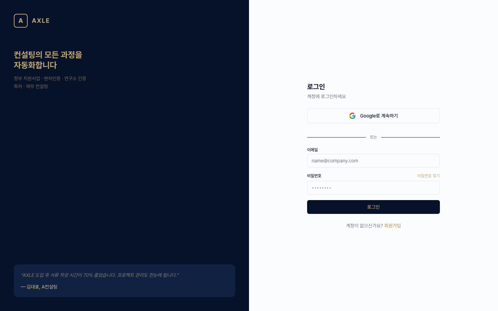
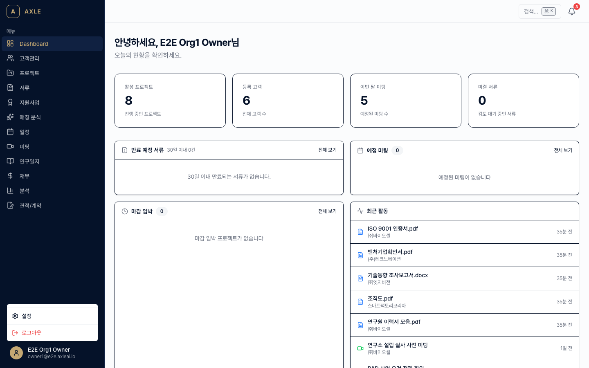
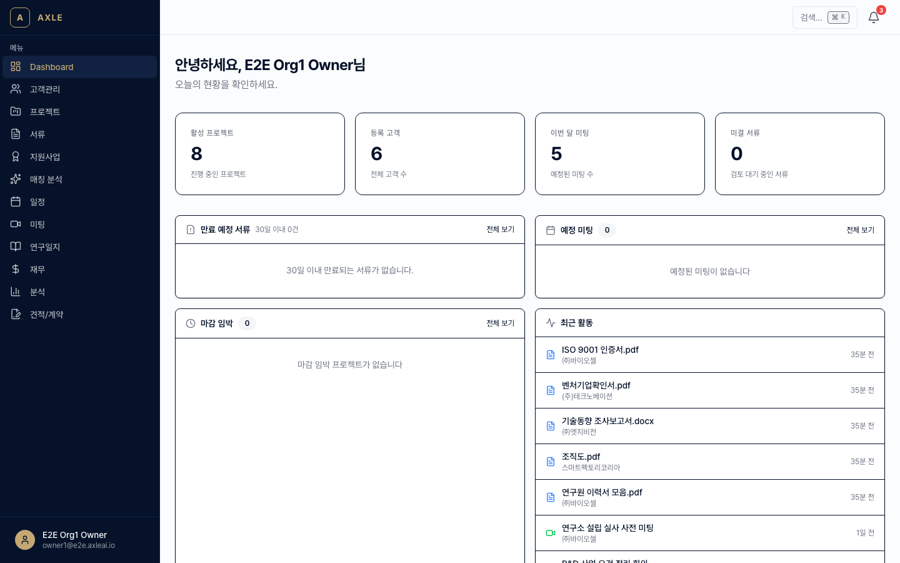

# 00. 시작하기

AXLE에 처음 접속했을 때 로그인부터 첫 작업을 시작하기까지의 흐름입니다.

---

## 이 장에서 할 수 있는 것

- 이메일 또는 Google 계정으로 로그인
- 초대받은 조직에 참여하거나 새 조직 생성
- AXLE 전체 화면 구조와 주요 메뉴 이해

---

## 1. 로그인

### 골든 패스

1. 웹 브라우저에서 [https://axleai.io](https://axleai.io)에 접속합니다.
2. 오른쪽 상단 **[로그인]** 또는 상단 바의 **[시작하기]**를 클릭합니다.
3. 로그인 화면(`/login`)에서 아래 중 하나를 선택합니다.
   - **Google로 계속하기**: Google 계정 OAuth 로그인
   - **이메일로 계속하기**: 매직 링크 방식 (이메일로 받은 링크 클릭 시 자동 로그인)
4. 로그인에 성공하면 `/dashboard`로 이동합니다.

💡 **팁** — 이메일 매직 링크는 10분 이내에 클릭해야 합니다. 만료되었다면 다시 요청하세요.

⚠️ **주의** — 회사 이메일로 가입 시 도메인이 기존 조직과 일치하면 해당 조직 참여 요청이 자동으로 생성됩니다.

### 회원가입이 처음이라면

`/signup` 화면에서 이메일을 입력하고 인증을 완료하면 **개인 워크스페이스**가 자동 생성됩니다. 이후 설정에서 조직 이름을 바꾸거나 팀원을 초대할 수 있습니다.

---

## 2. 조직 참여

AXLE의 모든 데이터(고객사, 프로젝트, 서류 등)는 **조직(Organization)** 단위로 격리됩니다.

### 초대받은 경우

1. 초대 이메일의 **[초대 수락]** 버튼을 클릭합니다.
2. 로그인이 안 되어 있다면 먼저 로그인합니다.
3. 조직에 참여되며 자동으로 해당 조직의 대시보드로 이동합니다.

### 여러 조직에 속한 경우

오른쪽 상단 사용자 메뉴에서 **[조직 전환]**으로 현재 작업 조직을 바꿀 수 있습니다.

---

## 3. 첫 화면 구조

로그인 직후 보이는 화면은 좌측 **사이드바**, 상단 **헤더**, 중앙 **본문**으로 구성됩니다.

### 사이드바 메뉴

| 메뉴 | 설명 | 참고 챕터 |
|------|------|---------|
| Dashboard | 조직 전체 현황, 최근 활동 | — |
| 고객관리 | 고객사·담당자·인증서 관리 | [01](./01-고객사-관리.md) |
| 프로젝트 | 컨설팅 프로젝트 관리 | [02](./02-프로젝트.md) |
| 서류 | 파일 저장, OCR, 체크리스트 | [03](./03-서류-관리.md) |
| 지원사업 | ProgramInfo 관리 | [07](./07-지원사업-매칭.md) |
| 매칭 분석 | AI 기반 고객사↔지원사업 매칭 | [07](./07-지원사업-매칭.md) |
| 일정 | Schedule·캘린더 | [08](./08-캘린더.md) |
| 미팅 | 미팅·녹음·전사 | [04](./04-미팅-전사.md) |
| 연구일지 | Journal·승인 | [10](./10-연구일지.md) |
| 재무 | ClientFinancial·Achievement | [09](./09-재무-성과.md) |
| 분석 | KPI·대시보드 | [09](./09-재무-성과.md) |
| 견적/계약 | Estimate·Contract | [06](./06-견적-계약.md) |

### 상단 헤더

- 🔍 **글로벌 검색** — 고객사/프로젝트/서류/미팅을 한 번에 검색 (단축키 `⌘+K` / `Ctrl+K`)
- 🔔 **알림 벨** — 읽지 않은 인앱 알림이 숫자 배지로 표시
- 👤 **사용자 메뉴** — 프로필, 조직 전환, 설정, 로그아웃

### 모바일

화면 폭이 좁은 경우 좌측 사이드바는 **햄버거(☰)** 버튼 안으로 숨겨집니다.

---

## 4. 첫 작업으로 무엇을 할까요?

추천 순서는 다음과 같습니다.

1. **조직 설정** — `/settings/organization`에서 조직명·로고를 등록합니다.
2. **팀원 초대** — `/settings/team`에서 팀원 이메일을 추가합니다.
3. **고객사 등록** — 사이드바 **[고객관리] → [+ 새 고객사]**로 첫 고객사를 등록합니다. → [01장](./01-고객사-관리.md)
4. **프로젝트 생성** — 해당 고객사에 대한 컨설팅 프로젝트를 만듭니다. → [02장](./02-프로젝트.md)

---

## 자주 묻는 질문

- **로그인이 안 돼요.** → 매직 링크 이메일이 스팸함에 있지 않은지 확인하세요. 그래도 안 되면 99장 [FAQ](./99-FAQ-문제해결.md)를 참고하세요.
- **조직을 바꾸고 싶어요.** → 조직을 새로 만드는 건 `/settings/organization`에서, 전환은 사용자 메뉴에서 가능합니다.
- **여러 역할을 가질 수 있나요?** → 조직 내에서 팀원 단위로 역할이 부여되며, 한 사람이 여러 조직에 속할 수 있습니다.

---

**다음 장** → [01. 고객사 관리](./01-고객사-관리.md)
