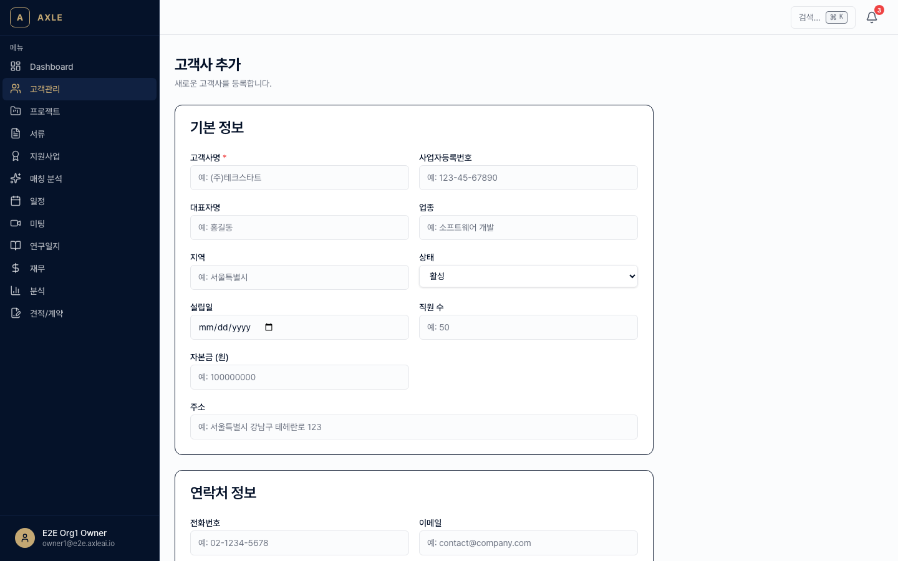
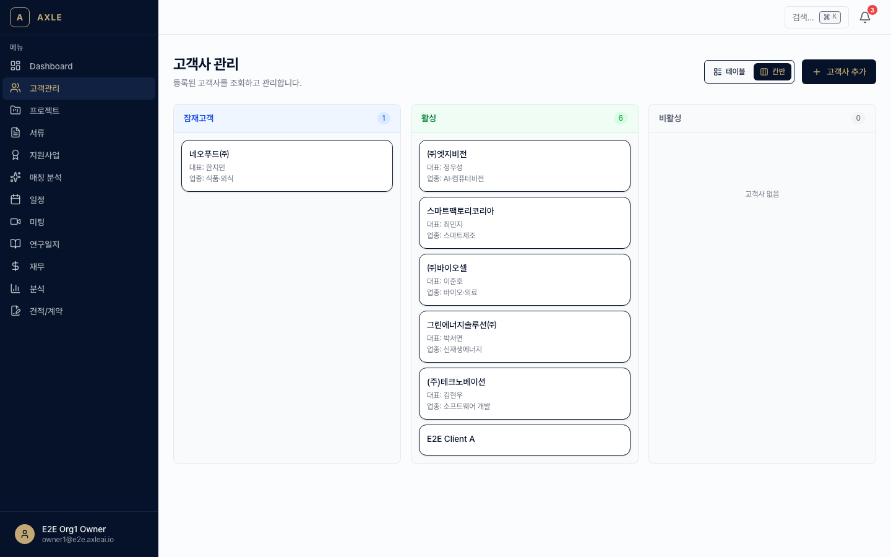
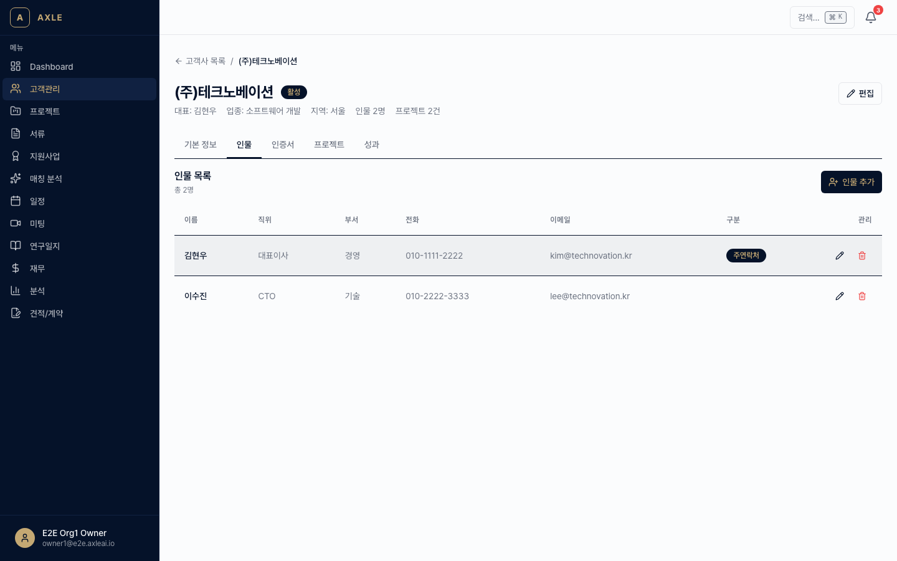
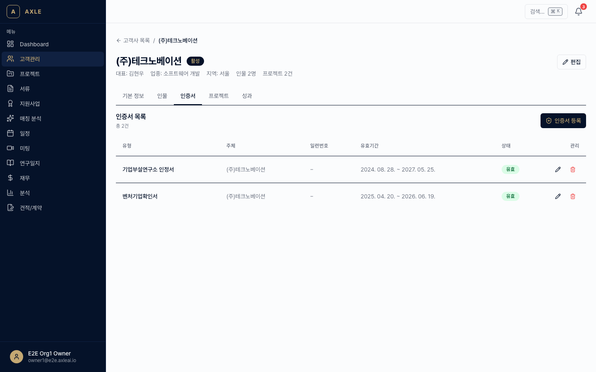

# 01. 고객사 관리

컨설팅 대상 기업과 담당자, 보유 인증서를 한 곳에서 관리합니다.

---

## 이 장에서 할 수 있는 것

- 고객사(Client) 등록·검색·파이프라인 관리
- 담당자(Contact) 등록 및 명함 이미지 OCR
- 사업자등록번호 실시간 검증(국세청 연동)
- 인증서(Certificate) 등록과 만료 추적
- AI 기반 고객사 마스터 프로필 자동 생성

---

## 1. 고객사 등록

### 골든 패스

1. 좌측 사이드바에서 **[고객관리]**를 클릭합니다. 경로: `/clients`
2. 우측 상단 **[+ 새 고객사]**를 클릭합니다. 경로: `/clients/new`
3. 필수 항목을 입력합니다.
   - *회사명* — 필수
   - *사업자등록번호* — 10자리 숫자 (자동 포맷)
   - *업종*, *설립일*, *대표자*, *주소* — 선택
   - *파이프라인 단계* — LEAD / QUALIFIED / PROPOSAL / NEGOTIATION / WON / LOST
4. **[저장]**을 클릭하면 목록으로 돌아가며 새 고객사가 추가됩니다.

💡 **팁** — 사업자등록번호를 입력하면 국세청 API를 통해 **계속/휴업/폐업** 상태가 자동으로 검증됩니다. 유효하지 않은 번호는 저장되지 않습니다.

### 목록과 검색

`/clients` 목록 화면에서는 다음이 가능합니다.

- 회사명·사업자번호·업종으로 검색
- 파이프라인 단계 필터
- 정렬(최근 등록/이름순)
- **칸반 뷰**로 전환 — 단계별로 드래그하여 이동

---

## 2. 담당자(Contact) 관리

각 고객사에는 여러 명의 담당자를 등록할 수 있습니다.

### 수동 등록

1. 고객사 상세 페이지(`/clients/[clientId]`)에서 **[담당자]** 탭을 엽니다.
2. **[+ 담당자 추가]**를 클릭하고 이름·직함·이메일·연락처를 입력합니다.

### 명함 OCR로 등록

1. **[명함 업로드]**를 클릭합니다.
2. 명함 사진(JPG/PNG)을 선택하면 Gemini Vision으로 자동 인식합니다.
3. 인식된 결과를 검토한 뒤 **[저장]**합니다. 수정도 가능합니다.

📌 **참고** — OCR은 보통 5~10초 내에 완료됩니다. 인식률을 높이려면 조명이 밝은 정면 사진을 권장합니다.

---

## 3. 인증서(Certificate) 관리

벤처기업·연구소·ISO 등 각종 인증서를 등록하고 만료일을 추적합니다.

1. 고객사 상세 페이지에서 **[인증서]** 탭을 엽니다.
2. **[+ 인증서 추가]** → 종류(벤처, 연구소, ISO 9001 등), 발급일, **만료일**, 발급기관을 입력합니다.
3. 첨부 파일(PDF/이미지)을 올려두면 만료 임박 시 **알림**이 발송됩니다.

💡 **팁** — 만료 30일 전/7일 전에 자동 알림이 발송됩니다. 알림 채널은 [11장](./11-알림-설정.md)에서 설정할 수 있습니다.

---

## 4. AI 마스터 프로필

고객사의 서류·미팅 기록을 종합해 **마스터 프로필**을 AI가 자동으로 생성합니다. 사업계획서 초안을 만들 때 이 프로필이 컨텍스트로 사용됩니다.

### 생성 방법

1. 고객사 상세 페이지에서 **[프로필 생성]** 또는 **[프로필 재생성]** 버튼 클릭.
2. AI 작업이 큐에 등록되며, 완료되면 알림이 옵니다(보통 1~3분).
3. **[프로필]** 탭에서 결과를 확인합니다. 섹션별(연혁/핵심기술/재무상태/특허 등)로 구성됩니다.

> _스크린샷 준비 중 — 마스터 프로필 뷰 안정화 후 촬영 예정._

⚠️ **주의** — 서류나 미팅 데이터가 거의 없으면 프로필 품질이 낮을 수 있습니다. 최소 3개 이상 서류 업로드 후 생성하는 것을 권장합니다.

---

## 5. 온보딩 체크리스트 발송

새 고객사가 제출해야 할 서류 목록을 **체크리스트**로 만들어 이메일로 발송할 수 있습니다.

1. 고객사 상세 페이지 → **[온보딩 발송]** 클릭.
2. 체크리스트 템플릿 선택(예: "사업계획서 작성용 기초 서류").
3. 수신자(담당자) 선택 → **[발송]**.
4. 고객사는 이메일 링크로 **[고객사 포털](./12-고객사-포털.md)**에 접근해 서류를 직접 업로드합니다.

---

## 자주 묻는 질문

- **폐업한 사업자는 어떻게 되나요?** → 등록 시 경고가 표시되지만 저장은 가능합니다. 상세 페이지에 "폐업" 배지가 표시됩니다.
- **고객사를 삭제하면 연결된 프로젝트·서류는?** → 실제 삭제가 아닌 **아카이브**입니다. 연결 데이터는 보존됩니다.
- **담당자 이메일이 여러 명이면?** → 주 담당자 1명 + 추가 담당자 여러 명 구조입니다. 알림 발송 시 전체 담당자에게 전달됩니다.

---

**이전 장** → [00. 시작하기](./00-시작하기.md) · **다음 장** → [02. 프로젝트](./02-프로젝트.md)
