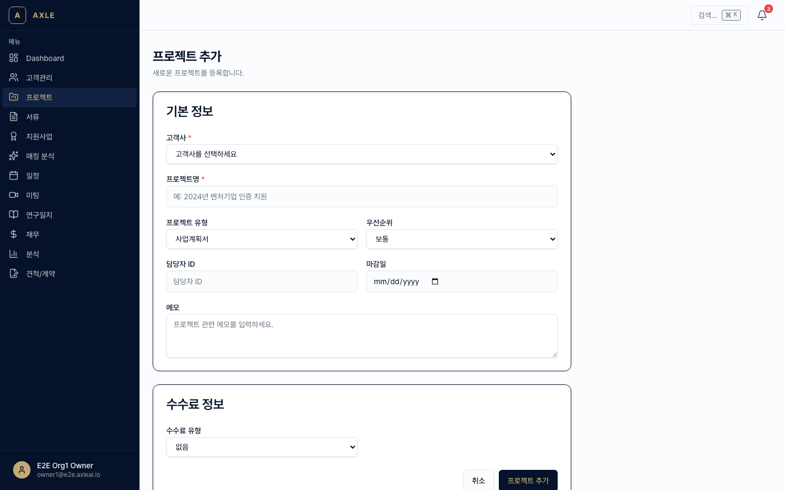
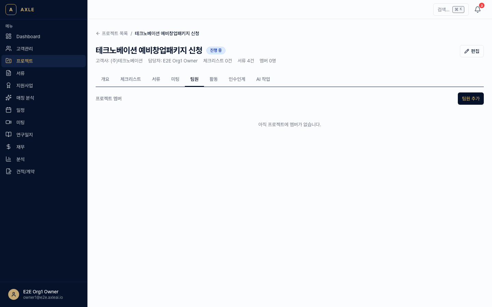
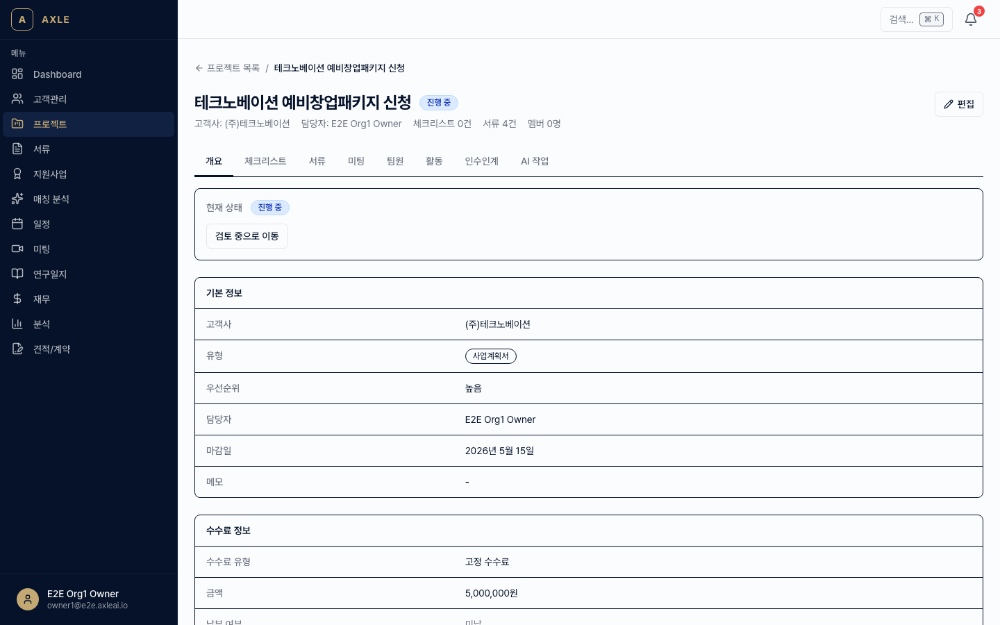
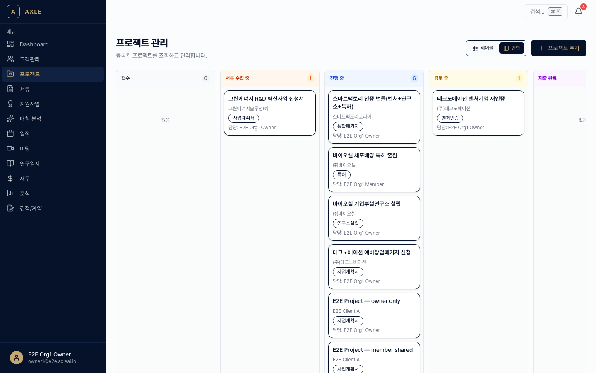

# 02. 프로젝트

AXLE에서 **프로젝트**는 하나의 컨설팅 건(예: 벤처인증 취득, 사업계획서 작성, 특허 출원 등)을 의미합니다.

---

## 이 장에서 할 수 있는 것

- 8가지 프로젝트 타입 선택과 생성
- 상태 머신(INTAKE → COMPLETED) 기반 진행 관리
- BUNDLE(묶음) 프로젝트로 하위 프로젝트 자동 생성
- 팀원 배정(LEAD / MEMBER / VIEWER)
- 수수료 방식(FIXED / SUCCESS_RATE / MONTHLY) 설정
- 조사 업무를 AI에 위임하는 RESEARCH_TASK

---

## 1. 프로젝트 타입

| 타입 | 설명 |
|------|------|
| VENTURE_CERT | 벤처기업 인증 |
| RESEARCH_LAB | 기업부설연구소 인증 |
| PATENT | 특허 출원 |
| BIZ_PLAN | 사업계획서 작성 |
| FINANCE | 재무 컨설팅 |
| BUNDLE | 여러 프로젝트를 묶은 상위 프로젝트 |
| RESEARCH_TASK | AI 조사 보고서 작업 |
| GENERAL | 위에 속하지 않는 일반 컨설팅 |

---

## 2. 프로젝트 생성

### 골든 패스

1. 사이드바 **[프로젝트]** → 우측 상단 **[+ 새 프로젝트]**. 경로: `/projects/new`
2. 필수 항목 입력.
   - *프로젝트명*
   - *고객사* — 기존에 등록된 고객사 선택 (없으면 먼저 [01장](./01-고객사-관리.md)에서 등록)
   - *타입* — 위 표 중 하나
   - *시작일*, *마감일*(선택)
   - *수수료 방식* — FIXED(고정금액) / SUCCESS_RATE(성공보수 %) / MONTHLY(월단위)
3. **[저장]** → 상세 페이지로 이동.



### BUNDLE 프로젝트

BUNDLE을 선택하면 추가로 **포함할 하위 프로젝트**를 지정할 수 있습니다.

- 예: "벤처 + 연구소 + 특허 + 소부장" 묶음 선택 → 저장 시 하위 프로젝트 4개가 자동 생성되고 BUNDLE 하위에 묶입니다.
- 하위 프로젝트들은 각자 독립된 진행 상태를 가지면서도 부모 BUNDLE에서 일괄 조회할 수 있습니다.

> _스크린샷 준비 중 — BUNDLE 타입 선택 UI 촬영 예정._

### RESEARCH_TASK 프로젝트

조사 업무를 AI(Claude)에 위임합니다.

1. 타입을 RESEARCH_TASK로 선택.
2. *조사 항목*에 질문/주제를 입력합니다. (예: "경쟁사 분석", "기술 동향")
3. 저장 시 AiJob이 자동으로 실행되며, 완료되면 보고서가 **서류**로 저장되어 프로젝트에 연결됩니다.

보통 5~15분 내에 완료되며, 알림으로 완료 시점을 받을 수 있습니다.

---

## 3. 상태 머신

프로젝트는 다음 상태를 순서대로 거칩니다.

```
INTAKE → PLANNING → IN_PROGRESS → REVIEW → COMPLETED
                                            ↓
                                       CANCELLED
```

| 상태 | 설명 |
|------|------|
| INTAKE | 접수, 초기 정보 수집 단계 |
| PLANNING | 일정·담당자·범위 확정 |
| IN_PROGRESS | 실제 작업 진행 |
| REVIEW | 내부/고객사 검토 |
| COMPLETED | 완료 |
| CANCELLED | 중단 (어느 단계에서든 전환 가능) |

### 상태 변경 방법

상세 페이지의 상태 배지를 클릭하면 **허용된 다음 상태만** 드롭다운으로 표시됩니다. 규칙을 벗어난 전환(예: COMPLETED → INTAKE)은 막힙니다.

> _스크린샷 준비 중 — 상태 드롭다운 촬영 예정._

---

## 4. 팀원 배정

각 프로젝트에는 팀원을 3가지 역할로 배정할 수 있습니다.

| 역할 | 권한 |
|------|------|
| LEAD | 모든 수정 권한, 고객사 대응 |
| MEMBER | 작업 실행, 서류 업로드 |
| VIEWER | 열람만 가능 |

### 배정 방법

1. 프로젝트 상세 페이지 → **[팀]** 탭.
2. **[+ 팀원 추가]** → 조직 내 사용자 검색 → 역할 선택 → **[저장]**.
3. 배정된 팀원은 대시보드에서 해당 프로젝트를 볼 수 있습니다.



📌 **참고** — 팀원이 아니더라도 조직 관리자는 모든 프로젝트를 조회할 수 있습니다.

---

## 5. 프로젝트 상세 페이지

상세 페이지는 탭으로 구성됩니다.

- **개요** — 기본 정보, 진행률, 마감까지 남은 일수
- **서류** — 프로젝트에 연결된 파일 ([03장](./03-서류-관리.md))
- **미팅** — 관련 미팅 이력 ([04장](./04-미팅-전사.md))
- **체크리스트** — 프로젝트 타입별 필수 서류 체크
- **액션 아이템** — 미팅에서 추출된 할 일 목록
- **타임라인** — 상태·담당자 변경 이력
- **팀** — 배정된 팀원



---

## 6. 목록 뷰: 테이블 / 칸반

`/projects`에서 상단의 토글로 두 뷰를 전환할 수 있습니다.

- **테이블**: 정렬·필터에 유리
- **칸반**: 상태별 시각화, 드래그로 상태 전환



---

## 자주 묻는 질문

- **마감일이 지나면?** → 상태는 자동 변경되지 않지만 대시보드에 "지연" 배지가 표시되고 담당자에게 알림이 발송됩니다.
- **BUNDLE에서 하위 프로젝트 하나를 빼려면?** → 하위 프로젝트 상세 → **[BUNDLE에서 분리]**. 분리해도 데이터는 유지됩니다.
- **수수료는 어디에 반영되나요?** → **[분석](../../apps/web/app/(app)/analytics)** 대시보드에서 월/분기별 예상 매출이 집계됩니다. [09장](./09-재무-성과.md) 참고.

---

**이전 장** → [01. 고객사 관리](./01-고객사-관리.md) · **다음 장** → [03. 서류 관리](./03-서류-관리.md)
