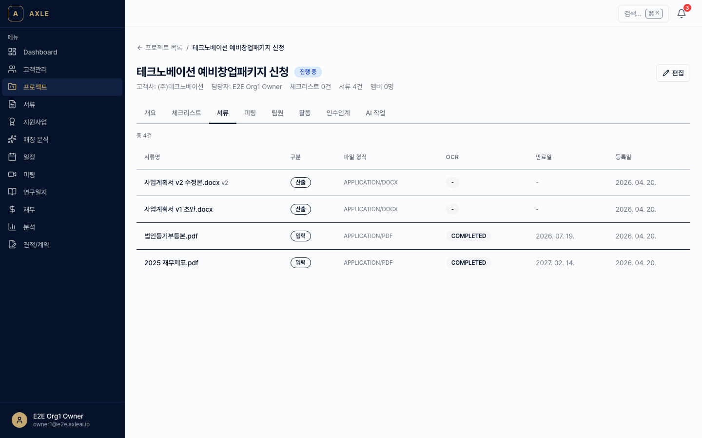
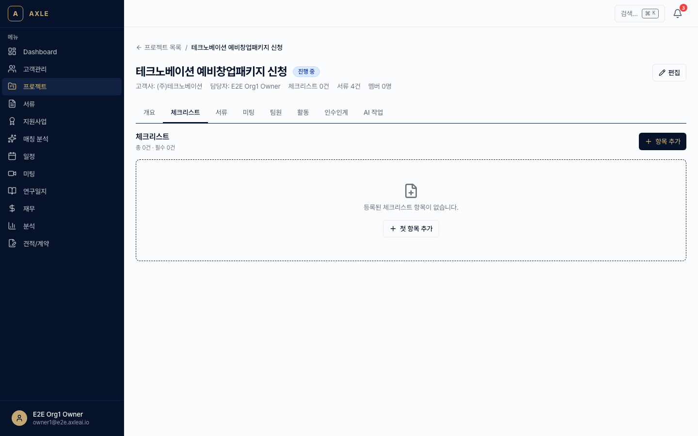
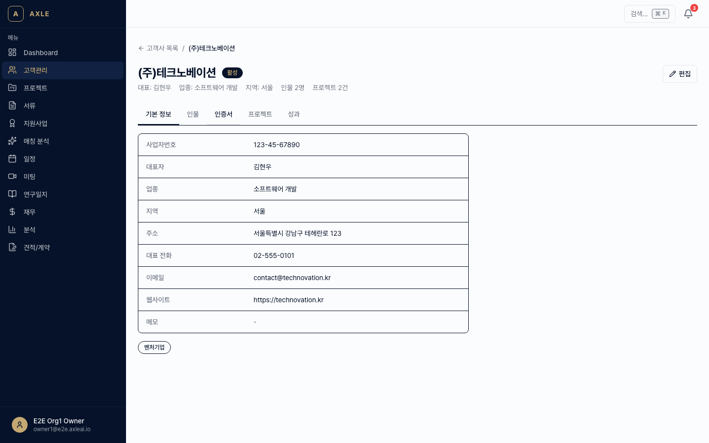

# 03. 서류 관리

AXLE의 서류(Document) 기능은 **파일 저장소 + OCR + 버전 관리 + 체크리스트**를 하나로 묶습니다.

---

## 이 장에서 할 수 있는 것

- 서류 업로드·미리보기·다운로드
- Gemini Vision 기반 OCR(텍스트 추출)
- 버전 관리 (원본 → 수정본 → 최종본)
- 프로젝트 타입별 체크리스트 템플릿 활용
- 외부인(고객사 등)에게 **토큰 업로드 링크** 발급
- 서류 만료일 추적과 자동 알림

---

## 1. 서류 업로드

### 골든 패스

1. 사이드바 **[서류]**로 이동합니다. 경로: `/documents`
2. 우측 상단 **[+ 업로드]**를 클릭합니다.
3. 드래그 앤 드롭 또는 파일 선택으로 업로드합니다.
   - 지원 확장자: PDF, DOCX, XLSX, HWP/HWPX, JPG, PNG, …
   - 단일 파일 최대 **50MB**
4. 업로드 중 **연결 대상**을 지정합니다.
   - *고객사* 또는 *프로젝트* (선택)
   - *카테고리* (사업계획서/재무/인증/기타)
   - *만료일* — 유효기간이 있는 서류라면 꼭 입력

> _스크린샷 준비 중 — 업로드 모달 촬영 예정._

💡 **팁** — 프로젝트 상세 페이지의 **[서류]** 탭에서 업로드하면 해당 프로젝트에 자동 연결됩니다.

---

## 2. 미리보기 & 다운로드

- 목록에서 서류를 클릭하면 **미리보기 모달**이 열립니다.
  - PDF/이미지: 뷰어 내 렌더링
  - DOCX/HWPX: 첫 페이지 썸네일 + 다운로드 버튼
- **[다운로드]** 버튼으로 원본 파일을 내려받습니다.

> _스크린샷 준비 중 — 서류 미리보기 모달 촬영 예정._

---

## 3. OCR (텍스트 추출)

이미지나 스캔 PDF에서 텍스트를 추출합니다.

1. 서류 상세에서 **[OCR 실행]** 클릭.
2. Gemini Vision이 텍스트를 추출하고 결과를 `ocrResult` 필드에 저장합니다.
3. 결과는 검색에 활용되며(전문 검색 가능), 사업계획서 RAG의 컨텍스트로도 사용됩니다.

📌 **참고** — OCR은 보통 10~30초 소요됩니다. 1000페이지 같은 초대형 문서는 분할해서 올리는 것이 안정적입니다.

---

## 4. 버전 관리

같은 서류의 개정본을 **부모-자식 관계**로 관리합니다.

1. 기존 서류 상세 → **[새 버전 업로드]**.
2. 새 파일을 올리면 `parentDocId`가 자동으로 연결되고 `version`이 +1됩니다.
3. 상세 화면에서 **[버전 이력]** 탭으로 전체 개정 히스토리를 조회합니다.

⚠️ **주의** — 새 버전을 올려도 이전 버전은 삭제되지 않습니다. 필요 시 별도로 아카이브 처리하세요.

---

## 5. 체크리스트

프로젝트 타입별 **필수 서류 목록**을 체크리스트로 관리합니다.

### 템플릿 사용

1. 프로젝트 상세 → **[체크리스트]** 탭.
2. **[템플릿 적용]** → 타입에 맞는 템플릿 선택(예: "벤처인증 기본 서류").
3. 체크리스트 항목이 자동으로 생성되고, 각 항목은 PENDING 상태로 시작합니다.

### 항목 관리

각 체크리스트 항목은 다음 상태를 가집니다.

| 상태 | 의미 |
|------|------|
| PENDING | 미제출 |
| UPLOADED | 서류 첨부됨 |
| VERIFIED | 검토 완료 |
| REJECTED | 반려 |

항목 행의 **[서류 연결]**을 클릭하면 이미 업로드된 서류 중 하나를 선택하거나 새로 업로드할 수 있습니다.

---

## 6. 토큰 업로드 링크

고객사가 **로그인 없이** 서류를 업로드할 수 있는 일회용 링크입니다.

### 발급 방법

1. 고객사 또는 프로젝트 상세 → **[업로드 링크 생성]**.
2. 유효기간(1일/7일/30일)과 허용 카테고리를 선택 → **[생성]**.
3. 링크가 생성되면 **[복사]** 또는 **[이메일로 발송]**으로 전달합니다.

### 고객사 화면

고객사는 링크를 열면 AXLE 로그인 없이 아래 흐름으로 업로드합니다.

1. 회사명·담당자명 확인 (링크에 사전 포함).
2. 요청된 서류 목록 확인.
3. 드래그 앤 드롭으로 업로드 → 완료.

업로드 완료 시 컨설턴트에게 알림이 발송됩니다.

⚠️ **주의** — 링크는 HMAC 서명이 포함되어 있어 변조가 불가능하지만, 유출 시 즉시 **[링크 폐기]** 기능으로 무효화할 수 있습니다.

---

## 7. 만료 추적

`expiresAt`이 설정된 서류는 만료일 **30일 전 / 7일 전 / 당일** 자동 알림이 발송됩니다.

- 알림 수신 대상: 해당 서류를 업로드한 사용자 + 연결된 프로젝트의 LEAD
- 채널: [11장 알림 설정](./11-알림-설정.md)에 따름

만료된 서류는 목록에서 빨간 배지로 표시됩니다.

---

## 자주 묻는 질문

- **파일 용량이 50MB를 넘어요.** → 분할 업로드 후 버전으로 연결하거나, 압축하여 올리세요.
- **OCR 결과가 깨져요.** → 저해상도 스캔본은 인식률이 떨어집니다. 재스캔 또는 수동 텍스트 입력을 고려하세요.
- **삭제 후 복구가 되나요?** → 30일 이내 휴지통에서 복원할 수 있습니다. 그 후에는 영구 삭제됩니다.

---

**이전 장** → [02. 프로젝트](./02-프로젝트.md) · **다음 장** → [04. 미팅 전사](./04-미팅-전사.md)
