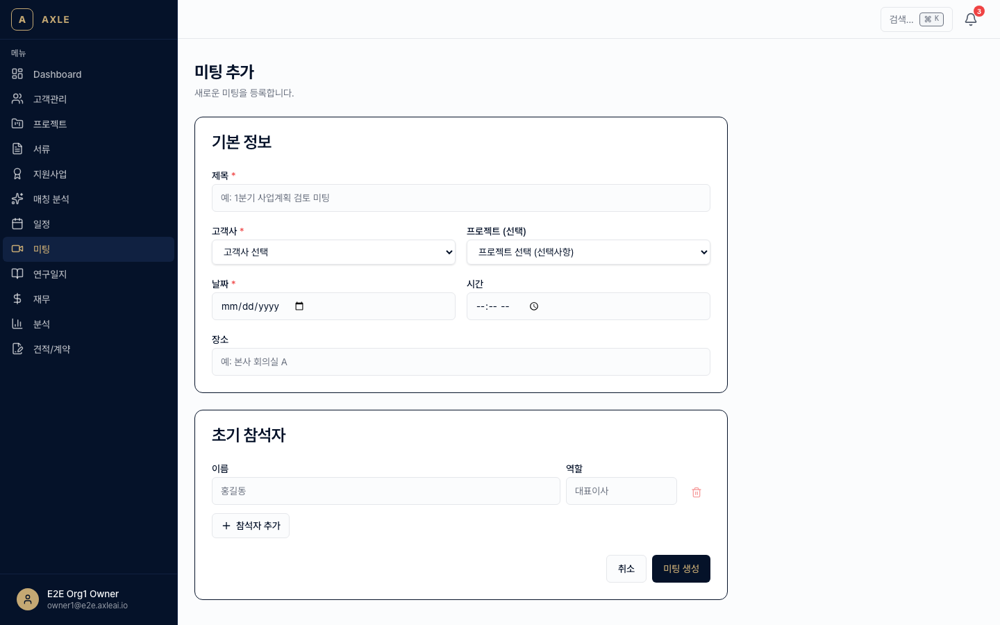
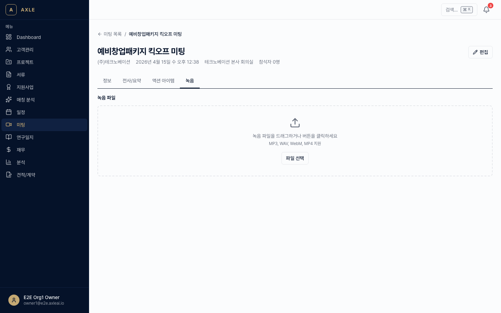
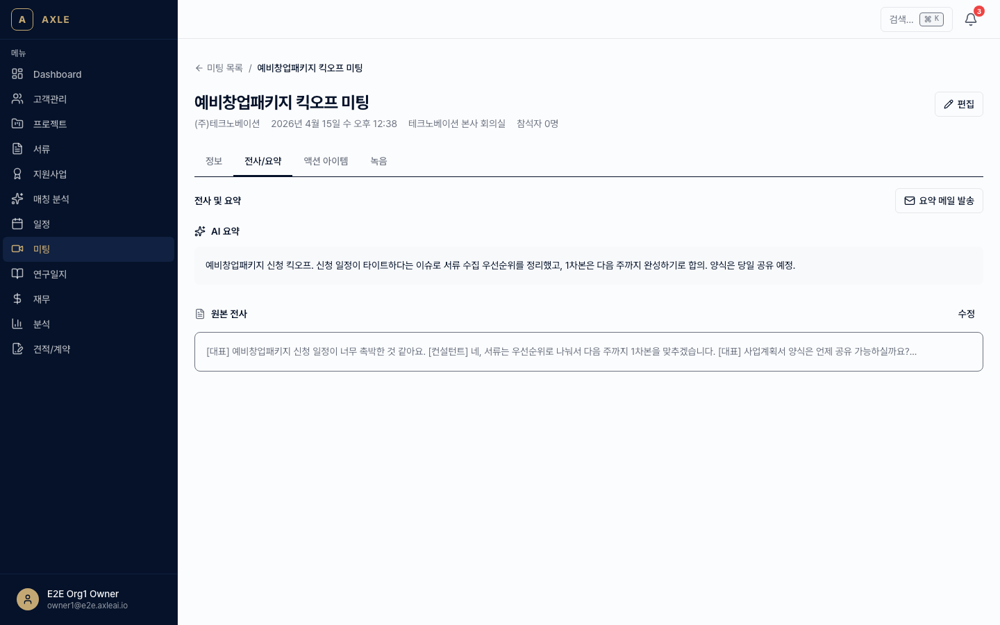
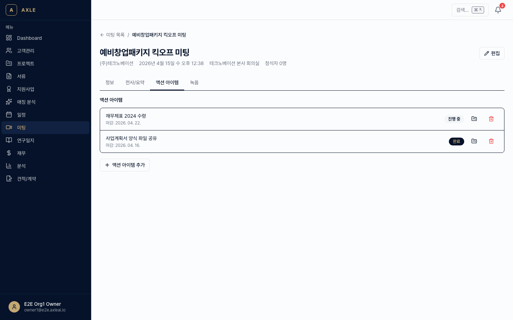
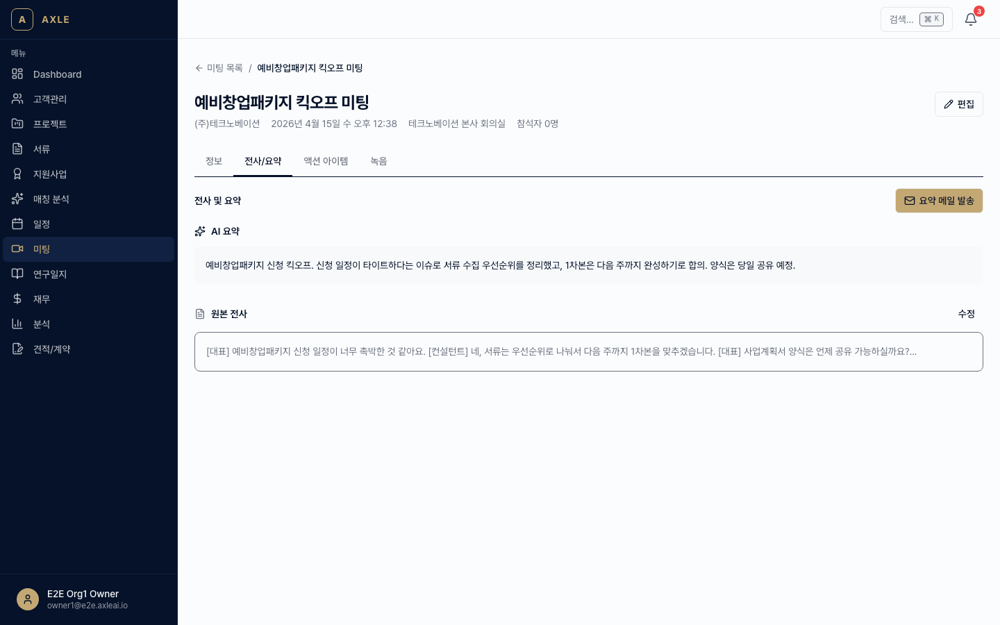

# 04. 미팅 전사

미팅을 녹음·업로드하면 AI가 자동으로 전사하고 요약·액션 아이템을 추출합니다.

---

## 이 장에서 할 수 있는 것

- 미팅 등록 (고객사·참석자 연결)
- 녹음 파일 업로드 → AI 자동 전사
- 요약·핵심 결정사항·액션 아이템 자동 추출
- 액션 아이템 → 새 프로젝트 자동 생성 제안
- 참석자 전원에게 요약 메일 자동 발송
- 녹음이 없을 때 수동 전사문 붙여넣기

---

## 1. 미팅 등록

### 골든 패스

1. 사이드바 **[미팅]** → **[+ 새 미팅]**. 경로: `/meetings/new`
2. 필수 항목 입력.
   - *제목*
   - *일시*
   - *고객사* — (선택, 등록되어 있으면 선택)
   - *프로젝트* — (선택)
   - *참석자* — 조직 내 팀원 + 고객사 담당자(Contact) 검색·추가
   - *미팅 유형* — 초기상담 / 정기미팅 / 킥오프 / 피드백 / 기타
3. **[저장]** → 상세 페이지로 이동.

---

## 2. 녹음 업로드

미팅 상세(`/meetings/[meetingId]`) 화면에서:

1. **[녹음 업로드]** 탭.
2. MP3/M4A/WAV/WEBM 파일을 업로드합니다. (최대 200MB, 최대 4시간)
3. 업로드와 동시에 **전사 작업**이 큐에 등록됩니다.

💡 **팁** — Desktop 앱을 사용하면 시스템 마이크 + 상대방 음성을 동시에 녹음할 수 있습니다. (Desktop 설치는 관리자 문서 참고)

---

## 3. AI 전사 · 요약

전사 → 요약은 두 단계로 실행됩니다.

### 1단계: 전사 (Transcription)

- 엔진: `mlx-whisper`(로컬) 또는 API Whisper
- 소요 시간: **미팅 시간의 약 10~30%** (1시간 녹음 → 6~20분)
- 진행 상태는 상세 화면에서 실시간 배지로 확인

### 2단계: 요약·액션 추출

전사가 완료되면 자동으로 다음이 추출됩니다.

| 항목 | 설명 |
|------|------|
| **요약(summary)** | 미팅 전체 요약 (3~5문단) |
| **핵심 결정사항** | 합의·결정된 내용 리스트 |
| **액션 아이템** | "누가 / 무엇을 / 언제까지" 형식 |

📌 **참고** — 전사 실패 시 원인이 상세에 표시됩니다. 파일 손상 / 오디오 없음 / 한국어 아님 등.

---

## 4. 액션 아이템 관리

자동 추출된 액션 아이템은 **[액션 아이템]** 탭에 표시됩니다.

- 담당자·마감일 수정 가능
- 체크박스로 완료 처리
- 마감일 접근 시 알림 발송

### 프로젝트 자동 생성

"신규 프로젝트 성격"으로 판단된 액션 아이템은 **[프로젝트로 전환]** 버튼이 표시됩니다.

1. 버튼 클릭 → 프로젝트 생성 모달.
2. 타입·담당자·마감일 확인 → **[생성]**.
3. 액션 아이템은 해당 프로젝트에 연결되고 상태가 "연결됨"으로 변경됩니다.

---

## 5. 요약 메일 자동 발송

전사가 완료되면 **참석자 전원**에게 요약 메일을 발송할 수 있습니다.

1. 미팅 상세 → **[요약 메일 발송]**.
2. 본문 미리보기에서 내용을 수정할 수 있습니다.
3. **[발송]** → 참석자에게 이메일이 나갑니다.

메일에는 요약·핵심 결정사항·액션 아이템이 포함되며, 원본 녹음은 포함되지 않습니다.

---

## 6. 수동 전사 입력

녹음 파일이 없거나 외부 전사 도구를 쓴 경우:

1. 상세 → **[수동 입력]** 탭.
2. 전사문을 붙여넣습니다.
3. **[요약 재생성]**을 누르면 붙여넣은 텍스트로 요약·액션 아이템을 추출합니다.

---

## 7. 미팅 검색

`/meetings` 목록에서 **제목·참석자·전사문 내용**까지 전문 검색이 가능합니다. 오래된 미팅에서 "XX 기술 언급한 회의"를 찾을 때 유용합니다.

---

## 자주 묻는 질문

- **한국어 외 언어도 되나요?** → 한국어·영어가 기본입니다. 일본어·중국어는 실험적으로 지원됩니다.
- **전사가 너무 오래 걸려요.** → 파일 크기/큐 혼잡도에 따라 지연될 수 있습니다. 30분 이상 소요되면 관리자에게 문의하세요.
- **전사 결과를 수정할 수 있나요?** → 네, **[전사]** 탭의 **[편집]** 버튼으로 직접 수정 후 저장할 수 있습니다. 수정하면 요약도 재생성 가능합니다.
- **민감한 내용인데 AI에 올려도 되나요?** → 요약은 조직 내부의 AI 파이프라인에서 처리되며, 외부 학습에 사용되지 않습니다. 단, 조직 보안 정책을 먼저 확인하세요.

---

**이전 장** → [03. 서류 관리](./03-서류-관리.md) · **다음 장** → [05. 사업계획서](./05-사업계획서.md)
