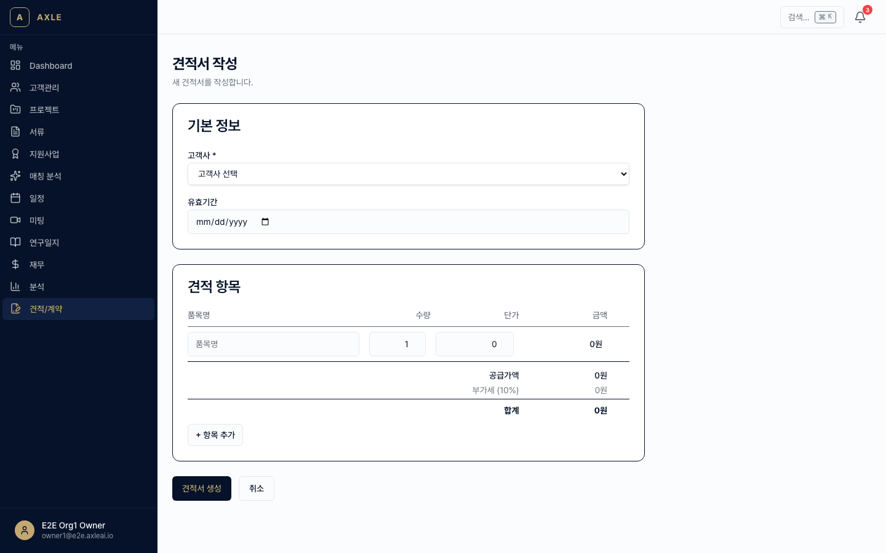
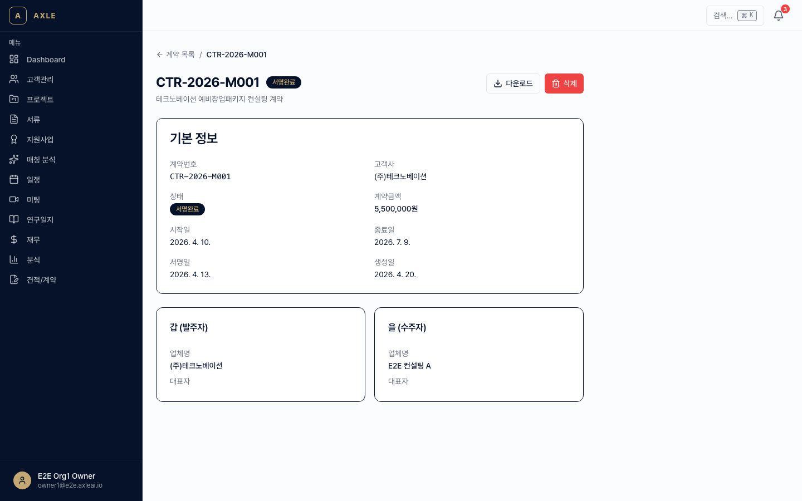
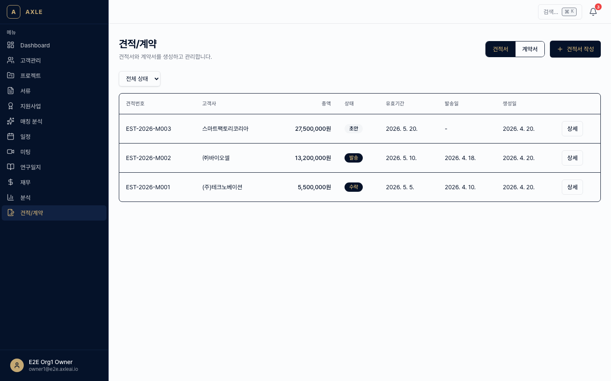

# 06. 견적·계약

견적서 발행부터 전자서명 계약까지 한 화면에서 처리합니다.

---

## 이 장에서 할 수 있는 것

- 견적서(Estimate) 생성·수정·발송
- 견적서 DOCX 다운로드 및 이메일 발송
- 견적 승인 시 계약서(Contract)로 자동 전환
- 전자서명 요청 및 서명 상태 추적
- 견적·계약 목록 조회 및 상태 필터

---

## 1. 견적서 생성

### 골든 패스

1. 사이드바 **[견적/계약]** → 견적 탭 → **[+ 새 견적]**. 경로: `/estimates/new`
2. 필수 항목 입력.
   - *고객사*
   - *프로젝트* — (선택, 있으면 자동 연결)
   - *견적 제목*
   - *유효기간* — 기본 30일
3. **항목 추가**
   - 품목명 / 단가 / 수량 / 합계(자동 계산)
   - 여러 항목 추가 가능
4. *부가세*(10% 기본) 자동 계산
5. *결제 조건*, *특이사항* 입력
6. **[저장]** → 상세 페이지로 이동.

💡 **팁** — 프로젝트에서 **[견적서 생성]** 버튼으로 들어오면 프로젝트 정보와 연결된 고객사가 자동으로 채워집니다.

---

## 2. 견적서 발송

상세 페이지에서:

1. **[DOCX 미리보기]**로 고객사에게 보낼 형태 확인.
2. **[이메일 발송]**.
   - 수신자: 고객사 담당자 자동 선택 (수정 가능)
   - 본문 템플릿 편집 가능
   - DOCX 첨부 + 견적 확인 링크 포함
3. 발송 기록은 EmailLog(이메일 이력)에 남고, 상태는 `SENT`로 변경됩니다.

> _스크린샷 준비 중 — 이메일 발송 모달 촬영 예정._

---

## 3. 견적 상태

| 상태 | 설명 |
|------|------|
| DRAFT | 작성 중 |
| SENT | 고객사에 발송됨 |
| VIEWED | 고객사가 링크 열람 |
| ACCEPTED | 고객사 승인 |
| REJECTED | 반려 |
| EXPIRED | 유효기간 만료 |

- VIEWED 상태는 링크 추적으로 자동 감지됩니다.
- ACCEPTED로 변경되는 경로는 두 가지입니다.
  - 고객사가 링크의 **[견적 승인]** 버튼 클릭
  - 컨설턴트가 수동으로 상태 변경

---

## 4. 계약서 전환

ACCEPTED 상태가 되면 **계약서로 전환** 버튼이 활성화됩니다.

### 골든 패스

1. 견적 상세 → **[계약서 생성]**.
2. 템플릿 선택(조직에서 미리 등록한 계약 템플릿 중 하나).
3. 자동 채움 확인.
   - 갑/을 정보
   - 금액(견적 기준)
   - 이행기간 / 수수료 방식 / 결제 조건
4. 추가 조항(별도 합의사항)을 입력할 수 있습니다.
5. **[생성]** → 새 계약(Contract)이 생성되고 프로젝트에 연결됩니다.

> _스크린샷 준비 중 — 계약서 생성 모달 촬영 예정._

📌 **참고** — 견적→계약 시 **프로젝트도 자동 생성**하는 옵션을 활성화하면, 아직 없는 프로젝트가 함께 만들어집니다.

---

## 5. 전자서명

### 서명 요청 발송

1. 계약 상세(`/contracts/[contractId]`) → **[서명 요청]**.
2. 서명자 목록 확인.
   - 갑(고객사 대표) / 을(조직 대표)
   - 필요 시 서명자 추가 가능(예: 공동대표)
3. 각 서명자 이메일·휴대폰 입력 → **[요청 발송]**.

### 서명 상태 추적

계약 상세 페이지에 각 서명자의 상태가 표시됩니다.

| 상태 | 의미 |
|------|------|
| PENDING | 요청은 갔으나 아직 서명 안 함 |
| VIEWED | 서명 링크를 열람함 |
| SIGNED | 서명 완료 |
| DECLINED | 서명 거절 |

### 서명 완료

모든 서명자가 SIGNED가 되면:

- 계약 상태가 **EXECUTED**로 변경
- 최종 서명본 PDF가 자동 생성되어 서류 목록에 저장
- 양쪽 서명자에게 완료 메일 발송

---

## 6. 목록과 필터

`/estimates`, `/contracts` 각 목록에서 다음이 가능합니다.

- 상태 필터(DRAFT / SENT / ACCEPTED 등)
- 고객사·프로젝트별 필터
- 금액 범위 필터
- 월/분기별 통계(합계·건수)

---

## 자주 묻는 질문

- **견적 템플릿을 조직에서 공유할 수 있나요?** → `/settings/organization`에서 템플릿 라이브러리를 관리할 수 있습니다(관리자 권한).
- **전자서명은 법적 효력이 있나요?** → 표준 전자서명 방식으로 법적 효력이 인정됩니다. 단, 필요 시 실물 계약서도 병행하세요.
- **계약서를 수정하려면?** → EXECUTED 이전에만 수정 가능합니다. 이후에는 **부속 합의서**를 별도로 작성하세요.
- **결제는 어떻게 추적하나요?** → 계약 상세에 결제 일정과 입금 확인 체크가 있습니다. 추후 재무 모듈과 연동됩니다.

---

**이전 장** → [05. 사업계획서](./05-사업계획서.md) · **다음 장** → [07. 지원사업 매칭](./07-지원사업-매칭.md)
