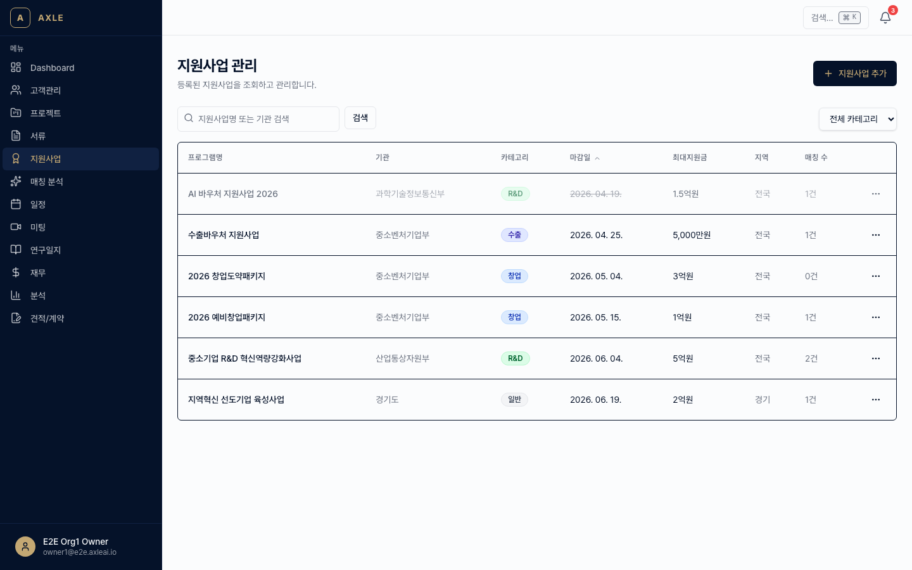
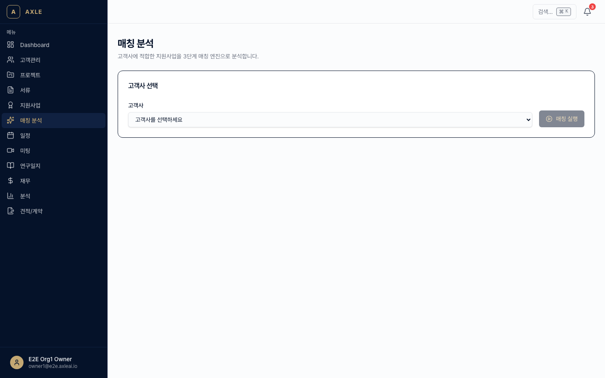

# 07. 지원사업 매칭

등록된 고객사 정보와 최신 지원사업 공고를 AI가 대조하여 **맞춤형 매칭 결과**를 제공합니다.

---

## 이 장에서 할 수 있는 것

- 지원사업(ProgramInfo) 조회·등록·수정
- 자동 크롤링된 최신 공고 확인
- 고객사별 매칭 점수 + 추천 사유 조회
- 관련성 없는 공고 제외(피드백)

---

## 1. 지원사업 관리 (ProgramInfo)

### 목록과 검색

1. 사이드바 **[지원사업]** → `/programs`.
2. 상단 필터.
   - 주관기관 (중기부·산업부·지자체 등)
   - 사업 유형 (R&D, 창업, 마케팅, 해외진출 등)
   - 마감 상태 (진행중 / 마감임박 / 종료)
   - 대상 (예비창업자 / 3년 이내 / 중소기업 등)

### 공고 자동 수집

AXLE는 매일 **기업마당 / K-Startup** 포털을 자동 크롤링해 ProgramInfo를 갱신합니다.

- 공고 상세 페이지에서 원문 링크로 바로 이동 가능
- 첨부 파일(공고문 PDF, 신청양식 HWPX)이 자동 저장
- 마감 3일 전 **알림**이 자동 발송됩니다

💡 **팁** — 크롤링에 누락된 공고는 `/programs/new`에서 수동 등록할 수 있습니다.

---

## 2. 매칭 분석

### 매칭 실행

매칭은 두 가지 방식으로 실행됩니다.

**A. 고객사 기준**

1. 고객사 상세 → **[지원사업 매칭]** 탭.
2. AXLE가 해당 고객사의 마스터 프로필과 모든 진행중 공고를 대조.
3. 점수 높은 순으로 정렬된 매칭 결과가 표시됩니다.

**B. 공고 기준**

1. 공고 상세 → **[매칭 대상 고객사]** 탭.
2. 조직 내 모든 고객사 중 해당 공고에 적합한 곳을 점수순으로 제시.

### 매칭 엔진 3단계

AXLE는 다음 3단계로 매칭 점수를 계산합니다.

| 단계 | 내용 | 효과 |
|------|------|------|
| 1. 실격 필터 | 자격 조건(업종·매출·업력 등) 충족 여부 | 부적합은 즉시 제외 |
| 2. 감점 규칙 | 과거 수혜 이력·지역 제한 등 | 점수 차감 |
| 3. AI 점수화 | 사업 내용·기술과 공고 취지 유사도 | 0~100점 |

결과 화면에서 각 항목이 **왜 그 점수인지** 설명이 표시됩니다.

---

## 3. 매칭 분석 대시보드

사이드바 **[매칭 분석]** → `/matching`에서 조직 전체의 매칭 현황을 한눈에 봅니다.

- 이번 주/달 신규 공고 건수
- 고객사별 매칭 가능 공고 수
- 마감 임박 공고 + 해당 공고에 적합한 고객사

---

## 4. 피드백 (학습 루프)

매칭 결과가 맞지 않으면 피드백을 남길 수 있습니다.

1. 매칭 결과 카드의 👍 / 👎 클릭.
2. 👎일 경우 사유 선택 (대상 아님 / 업종 맞지 않음 / 시점 부적절 / 기타).
3. 피드백은 SkillPattern에 누적되어 AI가 점점 더 정확해집니다.

---

## 5. 매칭된 공고로 프로젝트 만들기

매칭 결과에서 **[프로젝트 생성]**을 누르면:

1. 해당 고객사로 BIZ_PLAN 프로젝트가 자동 생성됩니다.
2. 대상 지원사업이 프로젝트에 연결됩니다.
3. 이후 [05장](./05-사업계획서.md) 사업계획서 생성 시 해당 공고의 양식·요건이 자동 반영됩니다.

---

## 자주 묻는 질문

- **공고가 너무 많이 매칭돼요.** → 필터에서 *최소 점수*를 70점 이상으로 올리거나, 고객사 프로필을 더 구체적으로 보강하세요.
- **피드백이 즉시 반영되나요?** → 즉시 반영되지 않고, 야간 배치에서 패턴이 누적·학습됩니다.
- **원문 공고가 업데이트되면?** → AXLE는 매일 재크롤링하고, 마감일·예산 변경 시 관련 고객사 담당자에게 자동 알림을 보냅니다.

---

**이전 장** → [06. 견적·계약](./06-견적-계약.md) · **다음 장** → [08. 캘린더](./08-캘린더.md)
