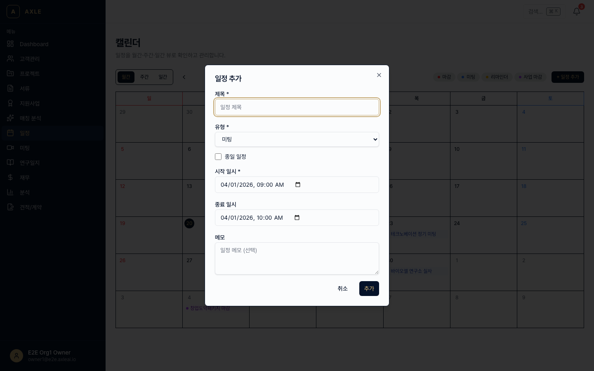
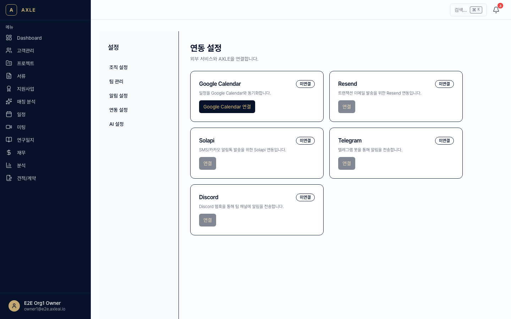
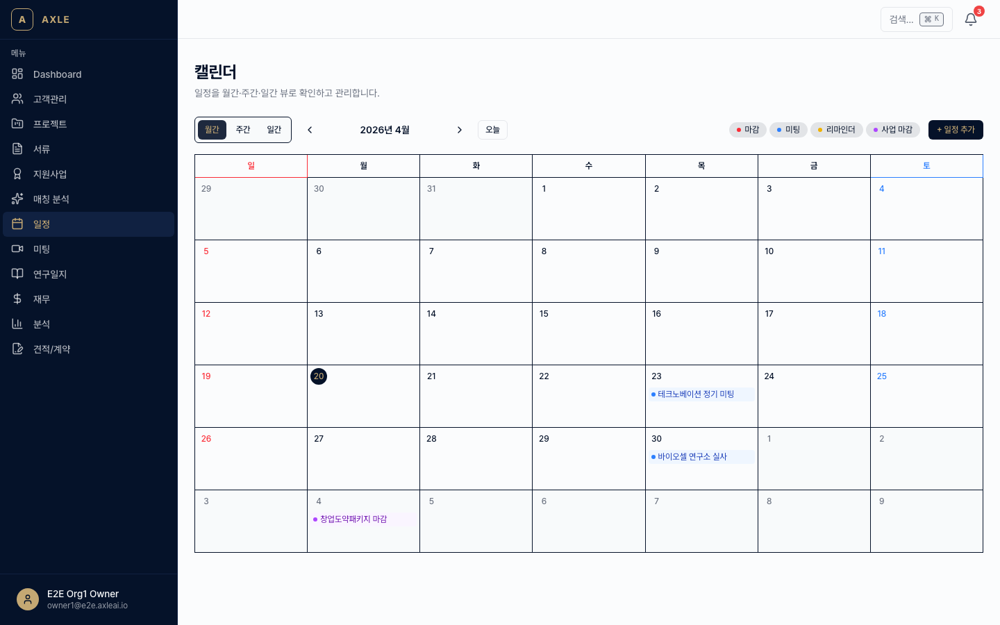

# 08. 캘린더

프로젝트 마감일, 지원사업 마감, 미팅 일정, 서류 만료 등 모든 시점을 한 달력에 통합합니다.

---

## 이 장에서 할 수 있는 것

- Schedule(일정) 등록·수정·삭제
- 월/주/일 뷰 전환
- Google Calendar 양방향 동기화
- 리마인더 자동 발송

---

## 1. 일정 타입

AXLE에서 일정은 4가지 타입으로 구분됩니다.

| 타입 | 설명 | 자동 생성 |
|------|------|---------|
| DEADLINE | 지원사업 마감, 서류 만료 | ✅ 자동 |
| MEETING | 미팅 | ✅ 미팅 생성 시 |
| TASK | 일반 할 일 | 수동 |
| REMINDER | 리마인더 | 설정 기반 |

자동 생성되는 일정은 원본 데이터(공고/미팅)와 연결되어 있으며, 원본이 바뀌면 자동 갱신됩니다.

---

## 2. 캘린더 뷰

사이드바 **[일정]** → `/calendar`.

- 좌측 상단: **월 / 주 / 일** 뷰 토글
- 좌측 하단: 필터 (타입별·프로젝트별·담당자별)
- 우측 상단: **[+ 일정 추가]**

클릭한 날짜의 일정 목록은 좌측 사이드 패널에 표시됩니다.

---

## 3. 일정 추가

1. **[+ 일정 추가]** 클릭.
2. 필수 항목.
   - *제목*
   - *시작 / 종료* (종일 옵션)
   - *타입*
   - *참여자* — 조직 내 팀원 선택
   - *리마인더* — 15분 전 / 1시간 전 / 1일 전 / 1주일 전 (다중 선택)
3. 연결 대상 (선택).
   - *고객사* / *프로젝트* / *지원사업*
4. **[저장]**.

---

## 4. Google Calendar 연동

팀원 각자가 본인 Google 계정과 연결할 수 있습니다.

### 연동 방법

1. 사이드바 하단 사용자 메뉴 → **[설정]** → `/settings/integrations`.
2. **Google Calendar** 카드 → **[연결]**.
3. Google 로그인 → 권한 승인.
4. 동기화 대상 캘린더를 선택.

### 동기화 규칙

- **AXLE → Google**: AXLE의 일정이 Google 캘린더에 생성됨
- **Google → AXLE**: 연결된 Google 캘린더의 일정이 AXLE에 TASK 타입으로 표시
- 동기화 주기: **5분**
- 수동 동기화: 상단 **[지금 동기화]** 버튼

### 연동 해제

**[설정] → [연동]**에서 언제든 해제 가능. 해제 시 이미 생성된 일정은 남고, 이후부터 동기화만 멈춥니다.

---

## 5. 리마인더

일정에 설정된 리마인더는 **인앱 알림 + 이메일**로 발송됩니다. 채널 추가(Push, Telegram 등)는 [11장](./11-알림-설정.md) 참고.

📌 **참고** — DEADLINE 타입은 기본으로 *7일 전 / 1일 전* 리마인더가 자동 설정됩니다.

---

## 6. 팀 캘린더

사이드바의 **필터**에서 *팀원 전체*를 선택하면 조직 전체 일정을 하나의 캘린더에 겹쳐 볼 수 있습니다. 팀원별 색상으로 구분됩니다.

---

## 자주 묻는 질문

- **Google 캘린더 여러 개를 연동할 수 있나요?** → 여러 캘린더 중 선택해 동기화할 수 있습니다. 개인·업무 구분 가능.
- **동기화된 일정을 AXLE에서 수정하면?** → AXLE가 주도한 일정(TASK 타입)만 Google로 역동기화됩니다. Google에서 만든 일정은 AXLE에서 편집할 수 없습니다.
- **리마인더가 중복돼요.** → AXLE와 Google 양쪽에서 리마인더가 발송될 수 있습니다. 한쪽을 끄세요.
- **공휴일을 표시하려면?** → Google의 공휴일 캘린더를 연결하면 자동으로 표시됩니다.

---

**이전 장** → [07. 지원사업 매칭](./07-지원사업-매칭.md) · **다음 장** → [09. 재무·성과](./09-재무-성과.md)
