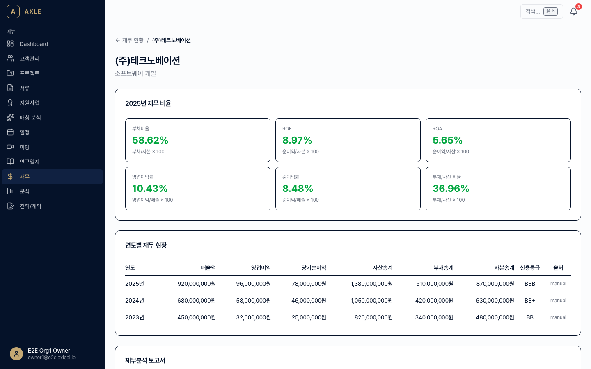
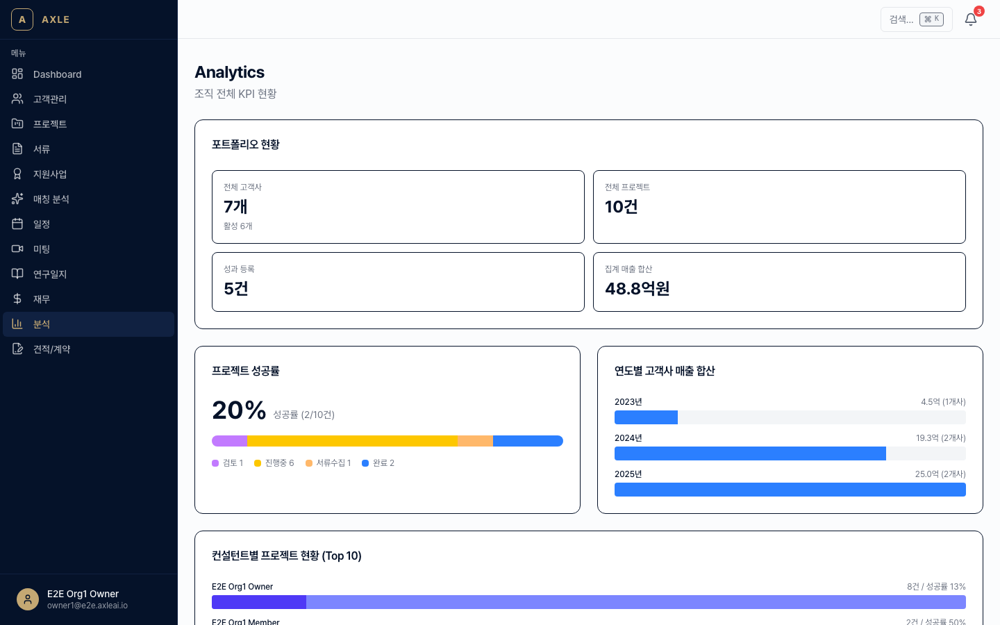
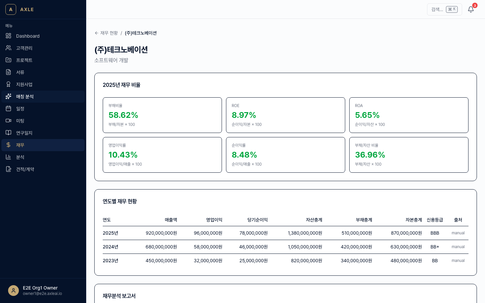

# 09. 재무·성과

고객사의 연도별 재무 데이터와 주요 성과(특허·수상·계약 등)를 관리하고 KPI 대시보드로 시각화합니다.

---

## 이 장에서 할 수 있는 것

- 고객사별 연도별 재무 데이터 입력·수정
- DART(전자공시) 자동 수집 (상장사)
- AI 기반 재무 분석 + 조정 컨설팅 제안
- 월간·연간 재무 리포트 DOCX 생성
- Achievement(성과) 관리: 특허·수상·계약·투자·인증
- 조직 KPI 대시보드 + 고객사별 재무 차트

---

## 1. 재무 데이터 관리

### 입력

1. 고객사 상세 → **[재무]** 탭. 혹은 사이드바 **[재무]** → 고객사 선택. 경로: `/finance/[clientId]`
2. **[+ 연도별 재무 추가]**.
3. 항목 입력.
   - 연도
   - 매출액 / 영업이익 / 당기순이익
   - 자산 / 부채 / 자본
   - 직원 수 / 연구개발비 / 수출액
4. **[저장]**.

💡 **팁** — 재무제표 PDF를 서류로 업로드하면 OCR로 숫자를 추출해 **자동 제안**됩니다.

### DART 자동 수집 (상장사)

상장사 고객사의 경우 DART OpenAPI로 재무 데이터를 자동 수집합니다.

1. 고객사 상세 → **[DART 연결]**.
2. 종목코드 입력 또는 회사명으로 검색.
3. **[수집 시작]** → 최근 3년치 사업보고서에서 재무 데이터를 자동 추출.
4. AutomationLog에 수집 이력이 남습니다.

수집 주기: 매일 새벽 공시 업데이트 시 자동 갱신.

---

## 2. AI 재무 분석

재무 데이터가 2년 이상 쌓이면 AI 분석이 가능합니다.

1. 고객사 재무 탭 → **[AI 분석]**.
2. 분석 항목 선택.
   - 성장성 / 수익성 / 안정성 / 활동성
   - 업종 평균 대비 비교
3. **[실행]** → 3~5분 후 결과 확인.

결과에는 다음이 포함됩니다.

- 지표 요약표
- 동업종 비교 그래프
- 컨설팅 제안 (예: "부채비율이 업종 평균 대비 20%p 높음. 재무 구조 개선 필요")

> _스크린샷 준비 중 — 재무 AI 분석 결과 뷰 촬영 예정._

---

## 3. 재무 리포트 (DOCX)

1. 재무 탭 → **[리포트 생성]**.
2. 기간 선택(최근 3년 등) → 템플릿 선택.
3. **[생성]** → DOCX 다운로드.

리포트에는 재무표·차트·AI 분석·개선 제안이 포함됩니다. 고객사에 바로 전달할 수 있는 수준의 양식입니다.

---

## 4. Achievement(성과) 관리

특허·수상·계약·투자·인증 등 주요 성과를 타임라인으로 관리합니다.

### 등록

1. 고객사 상세 → **[성과]** 탭.
2. **[+ 성과 추가]**.
3. 항목 입력.
   - 유형: PATENT / AWARD / CONTRACT / INVESTMENT / CERTIFICATION
   - 제목 / 일자 / 금액(해당 시) / 발급기관 / 첨부 파일
4. **[저장]**.

> _스크린샷 준비 중 — 성과 추가 모달 촬영 예정._

성과는 사업계획서 초안 생성 시 **실적 섹션**에 자동 반영됩니다.

---

## 5. 분석 대시보드

사이드바 **[분석]** → `/analytics`에서 조직 전체 KPI를 확인합니다.

- 월별 신규 고객사 / 프로젝트
- 진행중·완료 프로젝트 수
- 예상 매출(견적·계약 기반)
- 지원사업 신청 건수·승인율
- 팀원별 프로젝트 진행 현황

### 재무 대시보드

고객사별 재무 탭 상단에는 지표 차트가 표시됩니다(매출 추이, 영업이익률, ROE, 부채비율 등).

---

## 자주 묻는 질문

- **DART 수집이 실패해요.** → 비상장사는 DART에 공시되지 않습니다. 수동 입력하거나 재무제표 OCR을 사용하세요.
- **AI 분석 결과를 수정할 수 있나요?** → 리포트 생성 화면에서 각 섹션을 편집 후 DOCX로 내보낼 수 있습니다.
- **Achievement 삭제가 안 돼요.** → 사업계획서에 인용된 성과는 사업계획서에서 연결을 해제한 뒤에만 삭제 가능합니다.
- **환율/물가조정은 반영되나요?** → 현재는 명목 수치만 표시합니다. 조정 옵션은 향후 추가 예정입니다.

---

**이전 장** → [08. 캘린더](./08-캘린더.md) · **다음 장** → [10. 연구일지](./10-연구일지.md)
