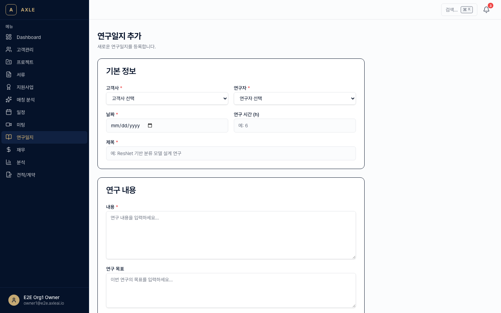
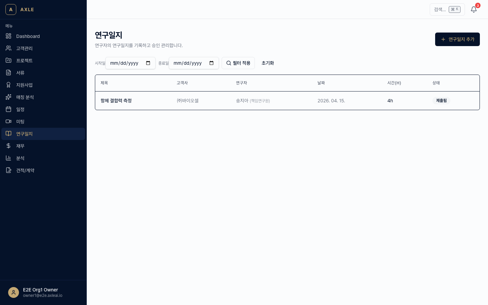
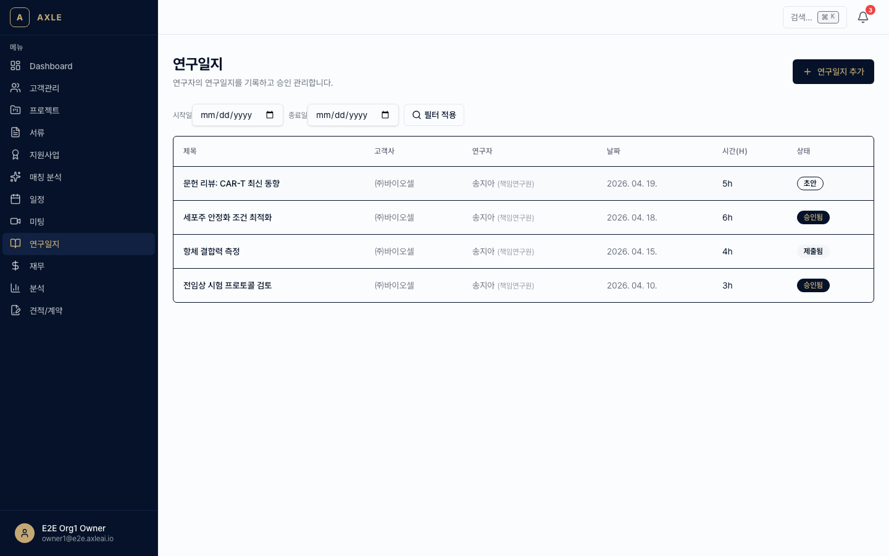

# 10. 연구일지

기업부설연구소 관리 핵심 업무인 **연구일지**를 AXLE에서 작성·승인·리포트 생성까지 한 번에 처리합니다.

---

## 이 장에서 할 수 있는 것

- 연구원별 일지 작성
- DRAFT → SUBMITTED → APPROVED 승인 워크플로우
- AI 초안 생성 (LOCAL_MLX)
- 월간 리포트 DOCX 자동 생성
- 연구원 포털로 외부 연구원 직접 작성 허용

---

## 1. 일지 작성

### 골든 패스

1. 사이드바 **[연구일지]** → **[+ 새 일지]**. 경로: `/journals/new`
2. 필수 항목.
   - *프로젝트* — 연구소 인증 대상 프로젝트 선택
   - *연구원* — 조직 내 연구원 선택
   - *작성일*
   - *연구 주제*
   - *내용* — 수행 업무, 결과, 특이사항
   - *첨부 파일* — 실험 기록·데이터 등 (선택)
3. **[임시저장(DRAFT)]** 또는 **[제출(SUBMITTED)]**.



💡 **팁** — AI 초안 기능으로 대략적인 틀부터 만들 수 있습니다. 하단 **2번** 항목 참고.

---

## 2. AI 초안 생성

연구원이 핵심 키워드만 입력하면 LOCAL_MLX가 일지 초안을 만들어줍니다.

1. 일지 작성 화면 하단 **[AI 초안 생성]** 클릭.
2. 키워드 입력 (예: "전극 소재 실험", "DFT 계산", "논문 리뷰").
3. 약 10~30초 후 초안이 채워집니다. 필요에 따라 수정 후 제출.

📌 **참고** — AI 초안은 **사실 확인이 필요한 참고 자료**입니다. 실험 수치 등은 반드시 실제 값으로 수정하세요.

---

## 3. 승인 워크플로우

```
DRAFT → SUBMITTED → APPROVED
                  ↘ REJECTED → DRAFT
```

| 상태 | 의미 | 다음 액션 |
|------|------|---------|
| DRAFT | 작성 중 | 본인이 수정 |
| SUBMITTED | 제출됨, 검토 대기 | 승인자가 확인 |
| APPROVED | 최종 승인 | 수정 불가 |
| REJECTED | 반려 | 작성자가 수정 후 재제출 |

### 승인자 역할

프로젝트 LEAD 또는 조직 관리자가 승인 권한을 가집니다.

1. 사이드바 **[연구일지]** → **[검토 대기]** 필터.
2. 목록에서 일지 클릭.
3. **[승인]** 또는 **[반려]** — 반려 시 사유 필수 입력.
4. 작성자에게 결과 알림 자동 발송.



---

## 4. 월간 리포트

연구소 보고용 **월간 DOCX 리포트**를 자동으로 생성합니다.

1. `/journals` 목록 상단 **[월간 리포트]**.
2. 연도·월 선택, 연구원 또는 프로젝트 필터.
3. **[생성]** → 해당 기간의 APPROVED 일지만 모아 DOCX를 만듭니다.

> _스크린샷 준비 중 — 월간 리포트 생성 UI 촬영 예정._

리포트에는 연구원별 요약, 전체 연구 성과, 특이사항이 포함됩니다.

---

## 5. 연구원 목록

`/journals` → **[연구원]** 탭에서 조직 내 연구원 목록과 각자의 일지 통계를 확인합니다.

- 최근 1개월 작성 건수
- 미제출 / 반려 건수
- 평균 승인 기간



---

## 6. 연구원 포털 (외부 연구원용)

외부 연구원이 AXLE 계정 없이 일지를 작성하도록 **연구원 포털** 링크를 발급합니다.

1. 연구원 상세 → **[포털 링크 생성]**.
2. 유효기간 선택(30일/90일/1년) → **[생성]** → 링크 복사 or 이메일 발송.
3. 외부 연구원은 링크로 접속해 본인 일지만 작성·조회합니다. 인증·승인은 조직 내 승인자가 처리.

> _스크린샷 준비 중 — 연구원 포털 링크 발급 UI 촬영 예정._

⚠️ **주의** — 포털 링크는 해당 연구원 전용입니다. 다른 연구원 데이터는 보이지 않으며, 링크를 폐기하면 즉시 무효화됩니다.

---

## 자주 묻는 질문

- **일지를 과거 날짜로 작성할 수 있나요?** → 네. 단, 승인자는 과거 일자 일지에 경고 플래그를 확인합니다.
- **APPROVED 이후 수정이 필요해요.** → 승인자가 일단 **[승인 취소]**를 눌러야 수정 가능합니다.
- **리포트 양식을 바꾸려면?** → `/settings/organization`의 *리포트 템플릿*에서 관리자가 커스텀 양식을 업로드할 수 있습니다.
- **연구소 인증 심사 시 AXLE 데이터를 바로 제출해도 되나요?** → 월간 리포트 DOCX로 내보낸 파일을 제출하세요. 원본 DB 데이터가 아닌 인쇄물/PDF 제출이 표준입니다.

---

**이전 장** → [09. 재무·성과](./09-재무-성과.md) · **다음 장** → [11. 알림 설정](./11-알림-설정.md)
