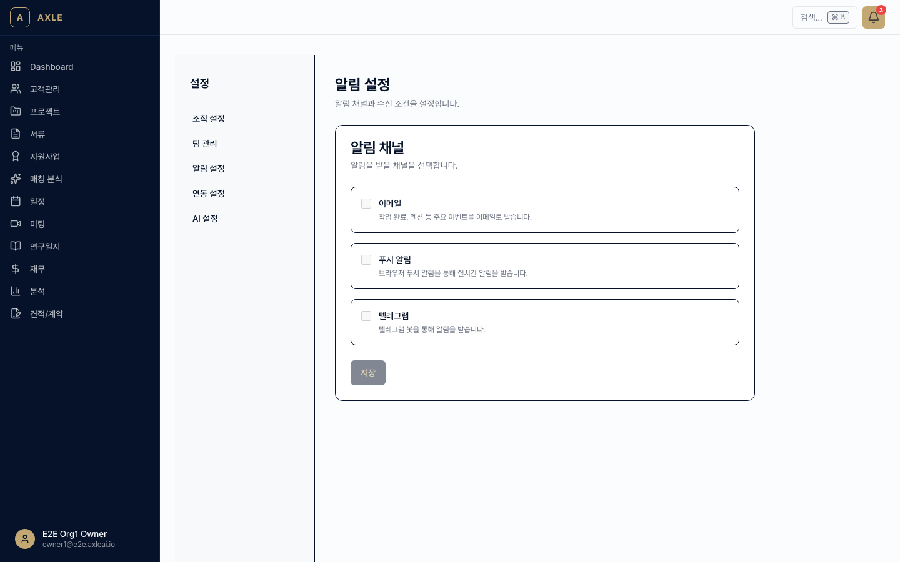
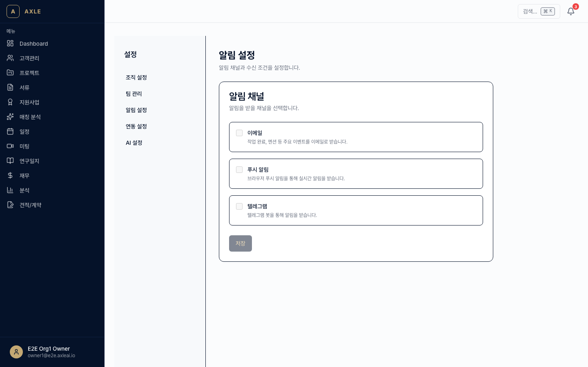
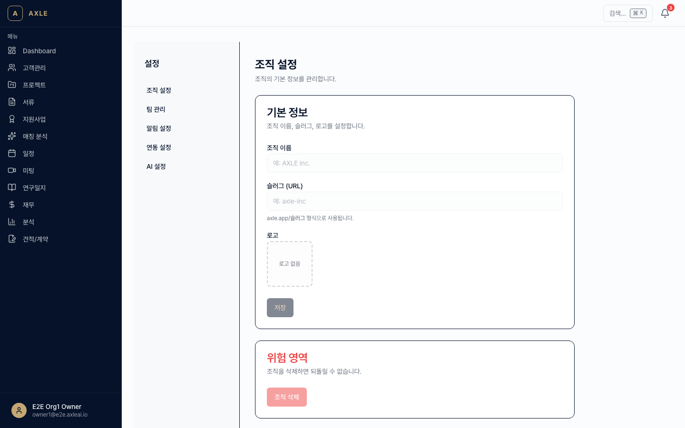
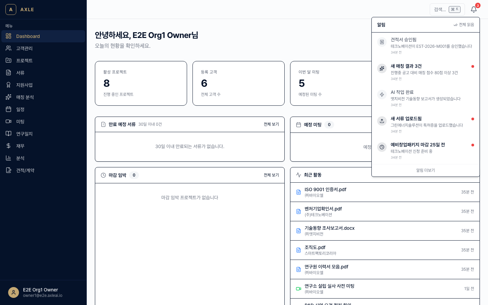

# 11. 알림 설정

AXLE의 각종 이벤트(서류 만료, 미팅 종료, 승인 요청 등)를 어떤 채널로 받을지 설정합니다.

---

## 이 장에서 할 수 있는 것

- 알림 종류별 수신 채널 On/Off
- 웹 Push 허용
- Telegram 연동 (긴급 알림)
- Discord 연동 (팀 채널 알림)
- 이메일 수신거부

---

## 1. 알림 종류

AXLE에는 현재 16가지 알림 타입이 있습니다.

| 분류 | 타입 | 발생 시점 |
|------|------|---------|
| 프로젝트 | PROJECT_ASSIGNED | 팀원 배정됨 |
| | PROJECT_STATUS_CHANGED | 상태 변경 |
| | PROJECT_DEADLINE | 마감일 임박 |
| 서류 | DOCUMENT_UPLOADED | 새 서류 업로드됨 |
| | DOCUMENT_EXPIRING | 서류 만료 임박 |
| | DOCUMENT_EXPIRED | 서류 만료 |
| 미팅 | MEETING_SCHEDULED | 미팅 일정 추가 |
| | MEETING_TRANSCRIPT_READY | 전사 완료 |
| 견적/계약 | ESTIMATE_SENT | 견적서 발송 |
| | ESTIMATE_ACCEPTED | 견적 승인됨 |
| | CONTRACT_SIGNED | 계약 서명 완료 |
| 지원사업 | PROGRAM_DEADLINE | 지원사업 마감 임박 |
| | PROGRAM_MATCHED | 새 매칭 결과 |
| 연구일지 | JOURNAL_SUBMITTED | 일지 제출됨 |
| | JOURNAL_APPROVED | 승인 완료 |
| 기타 | ACTION_ITEM_DUE | 액션 아이템 마감 |
| | BUNDLE_COMPLETE | BUNDLE 하위 전체 완료 |

---

## 2. 수신 채널

| 채널 | 특징 | 설정 위치 |
|------|------|---------|
| 인앱 알림 | 헤더의 🔔 벨에 표시 | 항상 ON (끌 수 없음) |
| 이메일 | 등록 이메일로 발송 | 기본 ON |
| 웹 Push | 브라우저 알림 | 브라우저에서 허용 필요 |
| Telegram | 긴급 알림 전용 | 개인 연동 |
| Discord | 팀 채널에 게시 | 조직 Webhook |

---

## 3. 개인 알림 설정

1. 사용자 메뉴 → **[설정]** → `/settings/notifications`.
2. 알림 타입별로 채널 On/Off 토글.
3. **[저장]**.

### 웹 Push 허용

1. 설정 페이지 상단 **[Push 활성화]** 클릭.
2. 브라우저 권한 요청 팝업에서 **허용**.
3. 모바일·데스크톱 브라우저 모두 작동합니다.

💡 **팁** — 브라우저를 닫아도 Push는 받을 수 있습니다. 단, 권한을 차단했다면 브라우저 설정에서 재허용해야 합니다.

### Telegram 연동

긴급 알림(예: 서류 만료 당일, 큰 금액 계약 서명)을 Telegram으로 받습니다.

1. `/settings/notifications` → **Telegram** 카드 → **[연결]**.
2. 표시된 코드를 **@AxleNotifyBot**에 `/start {코드}` 형식으로 보냅니다.
3. 연결 완료 시 테스트 메시지가 옵니다.

### Discord 연동 (조직 단위)

조직 관리자가 설정합니다.

1. `/settings/integrations` → **Discord** 카드 → **[Webhook URL 등록]**.
2. 알림 대상 채널과 타입을 선택.
3. 저장하면 해당 이벤트가 Discord 채널에 게시됩니다.

---

## 4. 이메일 수신거부

받은 이메일 하단의 **[수신거부]** 링크를 클릭하면 **이메일 채널만** 꺼집니다. (인앱·Push는 유지)

링크는 HMAC 토큰으로 서명되어 안전하며, 링크 한 번으로 즉시 처리됩니다.

---

## 5. 조직 단위 트리거 맵

조직 관리자는 **어떤 이벤트가 누구에게** 알림을 보낼지 매핑을 편집할 수 있습니다.

1. `/settings/organization` → **[알림 트리거]**.
2. 14개 비즈니스 이벤트 각각에 대해:
   - 발생 조건
   - 수신 역할(LEAD / MEMBER / VIEWER / 관리자 전체)
   - 채널 조합

기본값은 합리적으로 설정되어 있으므로, 특수한 운영 정책이 있을 때만 건드리세요.

---

## 6. 알림 벨에서 확인

헤더의 🔔 벨을 클릭하면 최근 20개의 알림이 표시됩니다.

- 읽지 않은 알림은 굵은 글씨
- 항목 클릭 시 관련 화면으로 이동하고 "읽음" 처리
- **[모두 읽음 처리]** 버튼으로 일괄 처리

---

## 자주 묻는 질문

- **알림이 너무 많아요.** → 설정에서 타입별로 채널을 끄세요. 중요한 것만 Push, 나머지는 이메일로 모아 받는 것을 권장합니다.
- **Telegram에서 메시지가 안 와요.** → 봇을 차단하지 않았는지 확인하세요. 재연결은 `/settings/notifications`에서 가능합니다.
- **휴가 모드가 있나요?** → 현재는 없습니다. 기간 동안 이메일/Push를 꺼두세요. (향후 추가 예정)
- **과거 알림을 보려면?** → `/notifications`에서 전체 이력 조회 가능.

---

**이전 장** → [10. 연구일지](./10-연구일지.md) · **다음 장** → [12. 고객사 포털](./12-고객사-포털.md)
