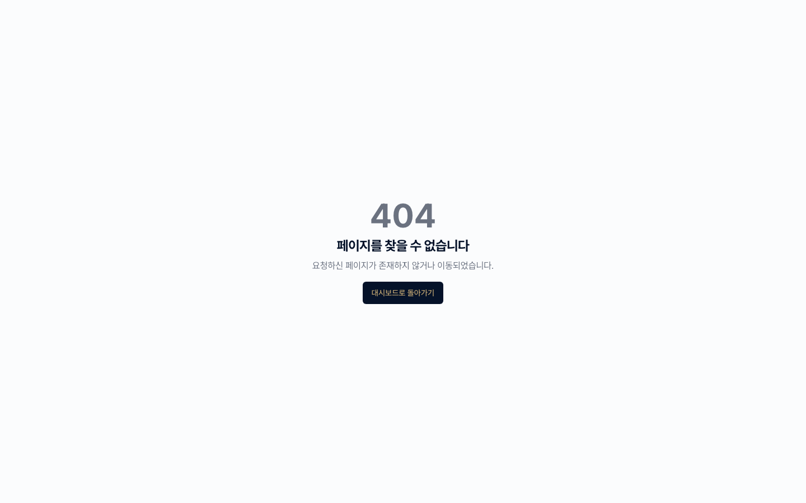

# 12. 고객사 포털

AXLE 계정이 없는 고객사도 **토큰 링크** 하나로 서류를 직접 업로드하고 프로젝트 진행 현황을 확인할 수 있습니다.

> 📌 **UI 안정화 안내** — 고객사 상세 페이지 내 **포털 링크 발급 탭**은 현재 개발·안정화 단계입니다. 이 장에 설명된 절차는 정식 릴리스 이후 최종 확정됩니다.

---

## 이 장에서 할 수 있는 것

- 고객사용 포털 링크 생성
- 고객사가 로그인 없이 접근하는 화면 이해
- 고객사가 업로드한 서류 자동 반영
- 포털 링크 만료·폐기 관리

---

## 1. 포털이 어떻게 다른가요?

| 구분 | AXLE 본 화면 | 고객사 포털 |
|------|-------------|-----------|
| 대상 | 컨설턴트(조직 구성원) | 외부 고객사 |
| 로그인 | 필수 | 불필요 (토큰 링크) |
| 볼 수 있는 범위 | 조직 전체 | **해당 고객사 본인 것만** |
| 가능한 작업 | 전체 기능 | 서류 업로드 + 진행현황 조회 |

포털은 HMAC 서명된 토큰 링크로 접근하며, 링크 자체에 접근 범위가 암호화되어 있습니다.

---

## 2. 포털 링크 생성

1. 고객사 상세(`/clients/[clientId]`) → **[포털 링크]** 탭.
2. **[+ 링크 생성]** 클릭.
3. 옵션 선택.
   - **유효기간** — 7일 / 30일 / 90일 / 사용자 지정
   - **허용 작업** — 서류 업로드 / 진행현황 조회 / 체크리스트 확인 (조합 가능)
   - **대상 프로젝트** — 특정 프로젝트 한정 혹은 전체
4. **[생성]** → 링크 URL이 표시됩니다.
5. **[복사]** 또는 **[이메일로 발송]**.

> _스크린샷 준비 중 — 포털 링크 생성 모달 촬영 예정._

💡 **팁** — 이메일 발송 시 AXLE가 간단한 안내문을 자동으로 포함합니다.

---

## 3. 고객사 화면 구성

고객사가 링크를 열면 보는 화면입니다.

### 3.1 상단 헤더

- 컨설팅 조직 로고 / 회사명 / 담당 컨설턴트
- 만료까지 남은 일수

### 3.2 진행현황 탭

- 진행 중인 프로젝트 목록 (상태 배지 포함)
- 각 프로젝트의 주요 마일스톤
- 최근 업데이트 타임라인

### 3.3 서류 탭

- **요청된 서류 목록** — 컨설턴트가 체크리스트로 지정한 것
- 드래그 앤 드롭 업로드
- 업로드된 서류의 접수 상태 표시

### 3.4 체크리스트 탭

- 필수 서류 목록 (제출 / 미제출)
- 각 항목에 대해 바로 업로드 가능

_(포털 홈 화면은 위 "진행현황" 이미지와 동일한 레이아웃에 체크리스트 탭이 표시됩니다.)_

---

## 4. 고객사 업로드 반영

고객사가 서류를 올리면:

1. AXLE 본 화면의 해당 고객사·프로젝트에 자동 연결됩니다.
2. 담당 컨설턴트에게 **즉시 알림**이 발송됩니다. (채널은 [11장](./11-알림-설정.md) 설정 기준)
3. 체크리스트 항목이 PENDING → UPLOADED로 변경됩니다.

⚠️ **주의** — 고객사 업로드는 AXLE 담당자가 **검토 → VERIFIED** 처리할 때까지 "미확인" 상태로 표시됩니다.

---

## 5. 링크 관리

### 조회

**[포털 링크]** 탭에 조직 내 모든 활성 링크가 표시됩니다.

- 생성자 / 생성일 / 만료일
- 마지막 접속 시각 / 총 접속 횟수
- 업로드된 서류 수

### 폐기

링크가 유출되었거나 필요가 없어지면:

1. 해당 링크 행의 **[폐기]** 클릭.
2. 확인 → 즉시 무효화됩니다. 링크를 누르면 만료 페이지가 표시됩니다.

> _스크린샷 준비 중 — 포털 링크 목록 UI 촬영 예정._

### 만료 연장

만료 임박인 링크는 **[연장]**으로 기간을 늘릴 수 있습니다. 링크 URL은 그대로 유지됩니다.

---

## 6. 보안 고려 사항

- 링크는 **HMAC 서명 + 만료 시각**이 포함되어 변조 불가능합니다.
- 링크만 있으면 접근 가능하므로 **메일/메신저 공유 시 수신자 확인 필수**.
- 고객사 포털은 읽기/제한된 쓰기만 허용되며, 다른 고객사 데이터에는 절대 접근할 수 없습니다.
- 중요 서류 요청 시 **이중 확인**(예: 전화로 링크 수신 확인) 권장.

---

## 자주 묻는 질문

- **한 고객사에 여러 링크를 만들 수 있나요?** → 네. 프로젝트별 / 담당자별로 분리해서 생성 가능합니다.
- **링크를 공유받은 고객사가 팀원에게 다시 공유해도 되나요?** → 기술적으로는 가능합니다. 접근 권한 분리가 필요하면 **각 담당자마다 링크를 별도로** 발급하세요.
- **모바일에서도 열리나요?** → 네. 반응형 UI로 스마트폰 브라우저에서도 동일하게 작동합니다.
- **고객사가 업로드한 파일이 바이러스라면?** → 업로드 시 Supabase Storage 측에서 기본 스캔이 수행되지만, 다운로드 전 확인을 권장합니다.

---

**이전 장** → [11. 알림 설정](./11-알림-설정.md) · **다음 장** → [99. FAQ·문제해결](./99-FAQ-문제해결.md)
